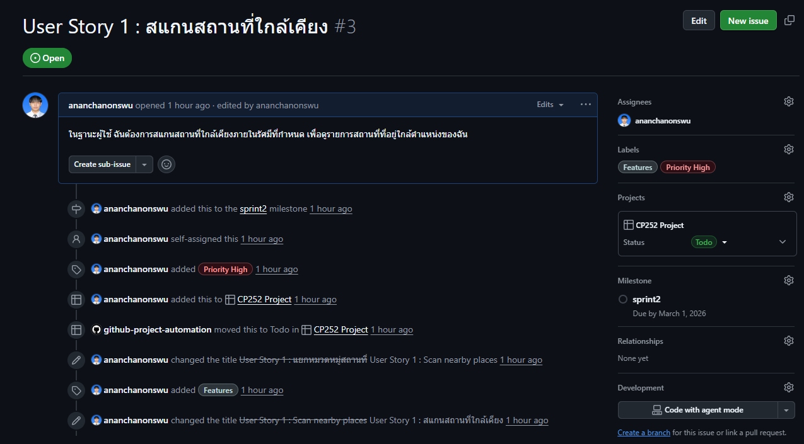
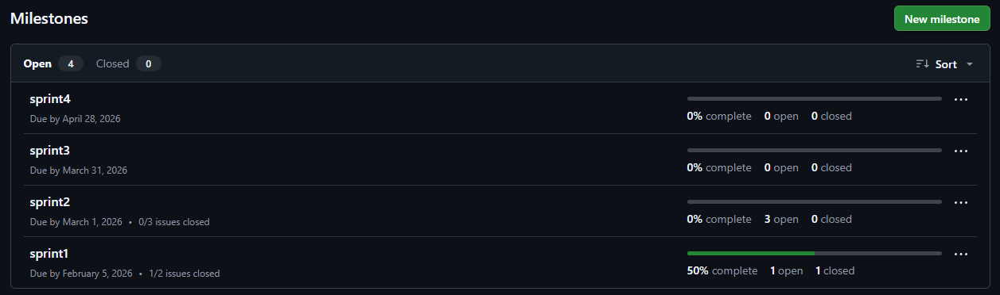

# pinme

# สมาชิกกลุ่ม

นายบุญยศักดิ์ รัตนดิลก ณ ภูเก็ต 67102010165

อนันฌานนทน์ แป้นสุวรรณ 67102010176

นายสิทธิโชติ เกรียงชัยพฤกษ์ 67102010224

## **1) ที่มาของปัญหาและความสำคัญ**

ในชีวิตประจำวัน ผู้ใช้มักต้องการค้นหาสถานที่ใกล้ตัวภายในระยะที่กำหนด เช่น ร้านอาหาร โรงแรม สนามกีฬา หรือสถานที่ท่องเที่ยว แต่การค้นหาผ่านหลายแพลตฟอร์มทำให้ข้อมูลกระจัดกระจาย ใช้เวลาในการเปรียบเทียบ และไม่สะดวกในการจัดหมวดหมู่เพื่อเลือกสถานที่ที่เหมาะสม

นอกจากนี้ เมื่อผู้ใช้ต้องการไปหลายสถานที่ในวันเดียว ยังขาดเครื่องมือที่ช่วย **จัดแผนแบบเป็นระบบ** เช่น การเรียงลำดับกิจกรรมและกำหนดช่วงเวลา ซึ่งทำให้แผนเดินทางสับสนและเกิดเวลาทับซ้อนกันได้ง่าย

ดังนั้น โครงงานนี้จึงมีความสำคัญในการพัฒนาระบบที่ช่วยให้ผู้ใช้สามารถ **สแกนสถานที่ใกล้เคียงตามรัศมี**, **จัดหมวดหมู่**, และ **วางแผนทริป 1 วัน** ได้อย่างเป็นระบบในแพลตฟอร์มเดียว

---

## **2) จุดประสงค์ของโครงงาน และประโยชน์ที่คาดว่าจะได้รับ**

### **จุดประสงค์ของโครงงาน (แก้ปัญหาอะไร)**
- พัฒนาระบบสำหรับค้นหาสถานที่ใกล้เคียงจากจุดตั้งต้นและระยะทางที่กำหนด พร้อมแยกหมวดหมู่สถานที่  
- เพิ่มฟังก์ชันการกรองและเรียงลำดับเพื่อช่วยให้ผู้ใช้ตัดสินใจได้เร็วขึ้น  
- พัฒนา **Mini Trip Planner (1 วัน)** เพื่อช่วยผู้ใช้เลือกหลายสถานที่และกำหนดช่วงเวลา โดยระบบตรวจสอบการทับซ้อนของเวลา  
- ฝึกกระบวนการพัฒนาซอฟต์แวร์ตามหลัก **Software Engineering (SDLC)** รวมถึงการออกแบบ การทดสอบ การวัดผล และการบริหารโครงงาน  

### **ประโยชน์ที่คาดว่าจะได้รับ**
- ผู้ใช้ค้นหาสถานที่ในรัศมีที่ต้องการได้รวดเร็วและเป็นหมวดหมู่  
- ลดเวลาการหาข้อมูลและการจัดแผนเดินทาง  
- ผู้ใช้สามารถวางแผนทริป 1 วันได้ชัดเจน ลดปัญหาเวลาทับซ้อน  
- ทีมพัฒนาได้ฝึกการทำงานแบบเป็นระบบ ใช้เครื่องมือ DevOps และสร้างเอกสารตามมาตรฐาน  

---

## **3) ขอบเขตของโครงงาน (Scope)**

### **สิ่งที่ทำ (In Scope)**
- ผู้ใช้เลือกจุดตั้งต้น (สถานที่/พิกัด) และกำหนดรัศมีค้นหา (กิโลเมตร)  
- ระบบสแกนและแสดงรายการสถานที่ใกล้เคียงภายในรัศมีที่กำหนด  
- แยกหมวดหมู่สถานที่: โรงแรม / ร้านอาหาร / สนามกีฬา / สถานที่ท่องเที่ยว  
- กรองและเรียงผลลัพธ์ (เช่น เรียงตามระยะใกล้สุด)  
- แสดงหน้ารายละเอียดสถานที่ (ชื่อ หมวดหมู่ ระยะทาง และปุ่มเปิดแผนที่)  
- ผู้ใช้สามารถบันทึกสถานที่ที่สนใจ (Bookmark)  
- **Mini Trip Planner (1 วัน):** เลือกหลายสถานที่ กำหนดเวลา แสดงเป็น timeline/ปฏิทิน และตรวจสอบเวลาทับซ้อน  

### **สิ่งที่ไม่ทำ (Out of Scope)**
- ไม่ทำการคำนวณเส้นทางที่ดีที่สุด (Route Optimization)  
- ไม่ทำระบบจองหรือชำระเงินจริง  
- ไม่ทำระบบรีวิวขั้นสูงหรือโซเชียลฟีด  
- ไม่ใช้ AI เพื่อแนะนำสถานที่ (ใช้การกรองและจัดหมวดหมู่ตามกฎ)  

---

## **4) Functional & Non-Functional Requirements**

### **4.1 Functional Requirements (FR)**
- **FR-01** ผู้ใช้สามารถเลือกจุดตั้งต้นและกำหนดรัศมีค้นหาได้  
- **FR-02** ระบบสามารถค้นหาและแสดงสถานที่ภายในรัศมีที่กำหนดได้  
- **FR-03** ระบบสามารถแยกผลลัพธ์ตามหมวดหมู่ (โรงแรม/ร้านอาหาร/สนามกีฬา/ท่องเที่ยว) ได้  
- **FR-04** ผู้ใช้สามารถกรองและเรียงผลลัพธ์ตามระยะทางได้  
- **FR-05** ผู้ใช้สามารถดูรายละเอียดสถานที่และเปิดดูตำแหน่งบนแผนที่ได้  
- **FR-06** ผู้ใช้สามารถบันทึก (Bookmark) และยกเลิก Bookmark ได้  
- **FR-07** ผู้ใช้สามารถสร้างทริป 1 วัน โดยเลือกหลายสถานที่ได้  
- **FR-08** ผู้ใช้สามารถกำหนดเวลาเริ่มต้น–สิ้นสุดของแต่ละสถานที่ในทริปได้  
- **FR-09** ระบบต้องตรวจสอบและแจ้งเตือนเมื่อเวลาของกิจกรรมในทริปทับซ้อนกัน  
- **FR-10** ระบบสามารถแสดงทริปเป็น timeline หรือปฏิทินรายวันได้  

### **4.2 Non-Functional Requirements (NFR)**
- **NFR-01 Usability:** ผู้ใช้สามารถสแกนสถานที่ได้ภายในไม่เกิน 3–4 ขั้นตอน  
- **NFR-02 Performance:** แสดงผลการสแกนภายใน 2 วินาที เมื่อจำนวนข้อมูลอยู่ในขอบเขตที่กำหนด  
- **NFR-03 Accuracy:** การคำนวณระยะทางต้องถูกต้องตามสูตรที่ใช้ (เช่น Haversine Formula)  
- **NFR-04 Reliability:** ผลลัพธ์ต้องสม่ำเสมอเมื่อใช้ input เดิม และการตรวจสอบเวลาทับซ้อนต้องเชื่อถือได้  
- **NFR-05 Maintainability:** โครงสร้างระบบแยกโมดูล (Scan / Filter / Trip / Bookmark) เพื่อให้แก้ไขและต่อยอดได้ง่าย  
- **NFR-06 Compatibility:** ระบบสามารถใช้งานผ่านเว็บเบราว์เซอร์ทั่วไปได้  

## 5) กระบวนการทำงาน (Process, Methods, and Tools)
Process (แนวทางพัฒนา)

ใช้กระบวนการพัฒนาแบบ Incremental + Iterative แบ่งงานเป็นรอบ (Sprint/Phase)

Phase 1: เก็บ requirement, user stories, scope, FR/NFR

Phase 2: ออกแบบระบบ (Architecture + Use Case) ออกแบบ UI ด้วย Figma และสร้างเว็บอย่างน้อย 2 หน้า พร้อม endpoint ประมวลผล input

Phase 3: พัฒนาเว็บเกือบสมบูรณ์ เพิ่ม unit tests ให้ครอบคลุม data structure 100% และเก็บค่า profiling baseline

Phase 4: พัฒนาเว็บสมบูรณ์ เพิ่ม UI tests, ทำ CI/CD และเปรียบเทียบผล profiling กับ Phase 3

### Methods (วิธีทำงาน)

Requirement elicitation & refinement

User stories และ acceptance criteria

Sprint planning และการติดตามงาน

Retrospective เพื่อปรับปรุงการทำงานในแต่ละ phase

### Tools (เครื่องมือที่ใช้)

Azure DevOps Boards: จัดการ Product และ Sprint Backlog

Azure Repos (Git): Version control, branch และ pull request

Figma: ออกแบบ UI และใช้ screenshot ประกอบรายงาน

Mermaid: สร้าง Use Case และ Architecture Diagram

Testing tools: เช่น Jest/Supertest สำหรับ unit test และ coverage

Profiling tools: เก็บข้อมูล static และ dynamic profiling

CI/CD Pipeline: ใช้ pipeline script ที่อาจารย์กำหนด

Communication: LINE/Discord, Zoom/Teams และ YouTube สำหรับ retrospective
---

## **6) Use Case Diagram**

## 7) process, methods, and tools 
- Process (กระบวนการทำงาน)
- ทีมงานใช้การพัฒนาแบบ Incremental + Iterative คือทำงานทีละส่วน และปรับปรุงแก้ไขไปเรื่อย ๆ โดยมีขั้นตอนหลักดังนี้
- Phase 1: เก็บและวิเคราะห์ requirement ของระบบ กำหนดขอบเขตโครงงาน และสรุปฟังก์ชันที่ต้องทำ
- Phase 2: ออกแบบระบบและหน้าจอการใช้งาน โดยใช้ Figma ช่วยออกแบบ UI และสร้างเว็บเบื้องต้น
- Phase 3: พัฒนาเว็บให้เกือบสมบูรณ์ เพิ่มการทดสอบระบบ และตรวจสอบประสิทธิภาพของโปรแกรม
- Phase 4: ปรับปรุงระบบให้สมบูรณ์ เพิ่มการทดสอบเพิ่มเติม และทำระบบ CI/CD
- การทำงานเป็นรอบ ๆ ช่วยให้สามารถตรวจสอบงานและแก้ไขปัญหาได้ตลอดการพัฒนา
- Methods (วิธีการทำงาน)
- ในการทำงาน ทีมใช้วิธีการดังนี้
- พูดคุยและสรุป requirement ร่วมกัน
- แบ่งงานตามความถนัดของสมาชิกในทีม
- วางแผนงานในแต่ละช่วง และติดตามความคืบหน้า
- ประชุมสรุปผลและทำ Retrospective หลังจบแต่ละ Phase
- จากการทำ Retrospective พบว่าช่วงแรกทีมมีความเข้าใจในขอบเขตโครงงานไม่ตรงกัน จึงแก้ไขโดยการสร้าง Prototype เพื่อช่วยให้เห็นภาพระบบชัดเจนมากขึ้น และทำให้ทุกคนเข้าใจตรงกัน
- Tools (เครื่องมือที่ใช้)
- ทีมงานใช้เครื่องมือต่าง ๆ เพื่อช่วยในการพัฒนาโครงงาน ได้แก่
- Azure DevOps Boards สำหรับจัดการงานและติดตามความคืบหน้า
- Azure Repos (Git) สำหรับเก็บและจัดการซอร์สโค้ด
- Figma สำหรับออกแบบหน้าจอการใช้งาน
- Mermaid สำหรับสร้างแผนภาพ Use Case
- เครื่องมือทดสอบ สำหรับตรวจสอบความถูกต้องของระบบ
- LINE / Discord / Zoom สำหรับการสื่อสารและประชุมทีม
## 8) Summary Requirement
-  หลังจากที่ได้อธิบายรายละเอียดของโปรเจกต์ให้กับกลุ่มอื่นรับฟัง ก็ได้รับผลตอบรับที่ดี และในส่วนของ requirement ก็ไม่มีประเด็นปัญหาที่ต้องแก้ไขมากนัก
-  ส่วนใหของ requirement 
-  1)เลือกจุดตั้งต้น
-  2)กำหนดระยะทาง
-  3)ค้นหาสถานที่ใกล้เคียง
-  4)แยกหมวดหมู่สถานที่
-  5)กรองและเรียงลำดับผลลัพธ์
-  6)แสดงรายละเอียดสถานที่
-  7)บันทึกสถานที่ที่สนใจ
-  8)สร้างแผนการเดินทาง 1 วัน
-  9)กำหนดช่วงเวลาในแผนการเดินทาง
-  10)ตรวจสอบความซ้ำซ้อนของเวลา
## 9) Summary Retrospective
-  ปัญหาเริ่มมาจากการมองภาพของโปรเจคนี้และscoopไม่ตรงกัน ทำให้เกิดปัญหาความขัดแย้ง ดังนั้นจึงแก้ปัญหาด้วยการสร้างprototype เพื่อปรับความเข้าใจกันทำให้มุมมองตรงกันและช่วยกันแก้ไขจนได้versionในปัจจุบัน และ อีกปัญหาคือการไม่คุ้นชินกับเครื่องมือที่ใช้เกียวกับการทำงาน

## 10) Product backlog: Work items ที่มีการใช้ issue (User Story)

## 11) Sprint backlog

## sprint 1 (Due Feb 5th)

## เป้าหมาย
เพื่อวิเคราะห์ความต้องการของระบบและจัดทำเอกสารที่เกี่ยวข้องก่อนเริ่มพัฒนาระบบจริง

## Issue ที่อยู่ใน Sprint 1
- ทำ Report และกำหนด Requirement

 

- sprint 2 - 4 : เพิ่มเติม Features หรือแก้ไข

