# สมาชิกกลุ่ม

นายบุญยศักดิ์ รัตนดิลก ณ ภูเก็ต 67102010165

อนันฌานนทน์ แป้นสุวรรณ 67102010176

นายสิทธิโชติ เกรียงชัยพฤกษ์ 67102010224

# pinme

## **1) ที่มาของปัญหาและความสำคัญ**

ในชีวิตประจำวัน ผู้ใช้มักต้องการค้นหาสถานที่ใกล้ตัวภายในระยะที่กำหนด เช่น ร้านอาหาร โรงแรม สนามกีฬา หรือสถานที่ท่องเที่ยว แต่การค้นหาผ่านหลายแพลตฟอร์มทำให้ข้อมูลกระจัดกระจาย ใช้เวลาในการเปรียบเทียบ และไม่สะดวกในการจัดหมวดหมู่เพื่อเลือกสถานที่ที่เหมาะสม

นอกจากนี้ เมื่อผู้ใช้ต้องการไปหลายสถานที่ในวันเดียว ยังขาดเครื่องมือที่ช่วย **จัดแผนแบบเป็นระบบ** เช่น การเรียงลำดับกิจกรรมและกำหนดช่วงเวลา ซึ่งทำให้แผนเดินทางสับสนและเกิดเวลาทับซ้อนกันได้ง่าย

ดังนั้น โครงงานนี้จึงมีความสำคัญในการพัฒนาระบบที่ช่วยให้ผู้ใช้สามารถ **สแกนสถานที่ใกล้เคียงตามรัศมี**, **จัดหมวดหมู่**, และ **วางแผนทริป 1 วัน** ได้อย่างเป็นระบบในแพลตฟอร์มเดียว

---

## **2) จุดประสงค์ของโครงงาน และประโยชน์ที่คาดว่าจะได้รับ**

### **จุดประสงค์ของโครงงาน (แก้ปัญหาอะไร)**
- พัฒนาระบบสำหรับค้นหาสถานที่ใกล้เคียงจากจุดตั้งต้นและระยะทางที่กำหนด พร้อมแยกหมวดหมู่สถานที่  
- เพิ่มฟังก์ชันการกรองและเรียงลำดับเพื่อช่วยให้ผู้ใช้ตัดสินใจได้เร็วขึ้น  
- พัฒนา **Mini Trip Planner (1 วัน)** เพื่อช่วยผู้ใช้เลือกหลายสถานที่และกำหนดช่วงเวลา โดยระบบตรวจสอบการทับซ้อนของเวลา  
- ฝึกกระบวนการพัฒนาซอฟต์แวร์ตามหลัก **Software Engineering (SDLC)** รวมถึงการออกแบบ การทดสอบ การวัดผล และการบริหารโครงงาน  

### **ประโยชน์ที่คาดว่าจะได้รับ**
- ผู้ใช้ค้นหาสถานที่ในรัศมีที่ต้องการได้รวดเร็วและเป็นหมวดหมู่  
- ลดเวลาการหาข้อมูลและการจัดแผนเดินทาง  
- ผู้ใช้สามารถวางแผนทริป 1 วันได้ชัดเจน ลดปัญหาเวลาทับซ้อน  
- ทีมพัฒนาได้ฝึกการทำงานแบบเป็นระบบ ใช้เครื่องมือ DevOps และสร้างเอกสารตามมาตรฐาน  

---

## **3) ขอบเขตของโครงงาน (Scope)**

### **สิ่งที่ทำ (In Scope)**
- ผู้ใช้เลือกจุดตั้งต้น (สถานที่/พิกัด) และกำหนดรัศมีค้นหา (กิโลเมตร)  
- ระบบสแกนและแสดงรายการสถานที่ใกล้เคียงภายในรัศมีที่กำหนด  
- แยกหมวดหมู่สถานที่: โรงแรม / ร้านอาหาร / สนามกีฬา / สถานที่ท่องเที่ยว  
- กรองและเรียงผลลัพธ์ (เช่น เรียงตามระยะใกล้สุด)  
- แสดงหน้ารายละเอียดสถานที่ (ชื่อ หมวดหมู่ ระยะทาง และปุ่มเปิดแผนที่)  
- ผู้ใช้สามารถบันทึกสถานที่ที่สนใจ (Bookmark)  
- **Mini Trip Planner (1 วัน):** เลือกหลายสถานที่ กำหนดเวลา แสดงเป็น timeline/ปฏิทิน และตรวจสอบเวลาทับซ้อน  

### **สิ่งที่ไม่ทำ (Out of Scope)**
- ไม่ทำการคำนวณเส้นทางที่ดีที่สุด (Route Optimization)  
- ไม่ทำระบบจองหรือชำระเงินจริง  
- ไม่ทำระบบรีวิวขั้นสูงหรือโซเชียลฟีด  
- ไม่ใช้ AI เพื่อแนะนำสถานที่ (ใช้การกรองและจัดหมวดหมู่ตามกฎ)  

---

## **4) Functional & Non-Functional Requirements**

### **4.1 Functional Requirements (FR)**
- **FR-01** ผู้ใช้สามารถเลือกจุดตั้งต้นและกำหนดรัศมีค้นหาได้  
- **FR-02** ระบบสามารถค้นหาและแสดงสถานที่ภายในรัศมีที่กำหนดได้  
- **FR-03** ระบบสามารถแยกผลลัพธ์ตามหมวดหมู่ (โรงแรม/ร้านอาหาร/สนามกีฬา/ท่องเที่ยว) ได้  
- **FR-04** ผู้ใช้สามารถกรองและเรียงผลลัพธ์ตามระยะทางได้  
- **FR-05** ผู้ใช้สามารถดูรายละเอียดสถานที่และเปิดดูตำแหน่งบนแผนที่ได้  
- **FR-06** ผู้ใช้สามารถบันทึก (Bookmark) และยกเลิก Bookmark ได้  
- **FR-07** ผู้ใช้สามารถสร้างทริป 1 วัน โดยเลือกหลายสถานที่ได้  
- **FR-08** ผู้ใช้สามารถกำหนดเวลาเริ่มต้น–สิ้นสุดของแต่ละสถานที่ในทริปได้  
- **FR-09** ระบบต้องตรวจสอบและแจ้งเตือนเมื่อเวลาของกิจกรรมในทริปทับซ้อนกัน  
- **FR-10** ระบบสามารถแสดงทริปเป็น timeline หรือปฏิทินรายวันได้  

### **4.2 Non-Functional Requirements (NFR)**
- **NFR-01 Usability:** ผู้ใช้สามารถสแกนสถานที่ได้ภายในไม่เกิน 3–4 ขั้นตอน  
- **NFR-02 Performance:** แสดงผลการสแกนภายใน 2 วินาที เมื่อจำนวนข้อมูลอยู่ในขอบเขตที่กำหนด  
- **NFR-03 Accuracy:** การคำนวณระยะทางต้องถูกต้องตามสูตรที่ใช้ (เช่น Haversine Formula)  
- **NFR-04 Reliability:** ผลลัพธ์ต้องสม่ำเสมอเมื่อใช้ input เดิม และการตรวจสอบเวลาทับซ้อนต้องเชื่อถือได้  
- **NFR-05 Maintainability:** โครงสร้างระบบแยกโมดูล (Scan / Filter / Trip / Bookmark) เพื่อให้แก้ไขและต่อยอดได้ง่าย  
- **NFR-06 Compatibility:** ระบบสามารถใช้งานผ่านเว็บเบราว์เซอร์ทั่วไปได้  

## 5) กระบวนการทำงาน (Process, Methods, and Tools)
Process (แนวทางพัฒนา)

ใช้กระบวนการพัฒนาแบบ Incremental + Iterative แบ่งงานเป็นรอบ (Sprint/Phase)

Phase 1: เก็บ requirement, user stories, scope, FR/NFR

Phase 2: ออกแบบระบบ (Architecture + Use Case) ออกแบบ UI ด้วย Figma และสร้างเว็บอย่างน้อย 2 หน้า พร้อม endpoint ประมวลผล input

Phase 3: พัฒนาเว็บเกือบสมบูรณ์ เพิ่ม unit tests ให้ครอบคลุม data structure 100% และเก็บค่า profiling baseline

Phase 4: พัฒนาเว็บสมบูรณ์ เพิ่ม UI tests, ทำ CI/CD และเปรียบเทียบผล profiling กับ Phase 3

### Methods (วิธีทำงาน)

Requirement elicitation & refinement

User stories และ acceptance criteria

Sprint planning และการติดตามงาน

Retrospective เพื่อปรับปรุงการทำงานในแต่ละ phase

### Tools (เครื่องมือที่ใช้)

Azure DevOps Boards: จัดการ Product และ Sprint Backlog

Azure Repos (Git): Version control, branch และ pull request

Figma: ออกแบบ UI และใช้ screenshot ประกอบรายงาน

Mermaid: สร้าง Use Case และ Architecture Diagram

Testing tools: เช่น Jest/Supertest สำหรับ unit test และ coverage

Profiling tools: เก็บข้อมูล static และ dynamic profiling

CI/CD Pipeline: ใช้ pipeline script ที่อาจารย์กำหนด

Communication: LINE/Discord, Zoom/Teams และ YouTube สำหรับ retrospective
---

## **6) Use Case Diagram**


```mermaid
flowchart TB
  user([User])

  uc1((Select location & radius))
  uc2((Scan nearby places))
  uc3((Filter & sort results))
  uc4((View place detail))
  uc5((Bookmark place))
  uc6((Create 1-day trip plan))
  uc7((Set time for each activity))
  uc8((Validate time conflict))
  uc9((View trip as timeline/calendar))

  user --> uc1
  user --> uc2
  user --> uc3
  user --> uc4
  user --> uc5
  user --> uc6
  user --> uc7
  user --> uc8
  user --> uc9
```


## 7) process, methods, and tools 

1) Process (กระบวนการทำงาน)
  
ทีมงานใช้การพัฒนาแบบ Incremental + Iterative คือทำงานทีละส่วน และปรับปรุงแก้ไขไปเรื่อย ๆ โดยมีขั้นตอนหลักดังนี้
- Phase 1: เก็บและวิเคราะห์ Requirement ของระบบ กำหนดขอบเขตโครงงาน และสรุปฟังก์ชันที่ต้องทำ
- Phase 2: ออกแบบระบบและหน้าจอการใช้งาน โดยใช้ Figma ช่วยออกแบบ UI และสร้าง Website เบื้องต้น
- Phase 3: พัฒนา Website ให้เกือบสมบูรณ์ เพิ่มการทดสอบระบบ และตรวจสอบประสิทธิภาพของโปรแกรม
- Phase 4: ปรับปรุง Website ให้สมบูรณ์ เพิ่มการทดสอบเพิ่มเติม และทำระบบ CI/CD
- การทำงานเป็นรอบ ๆ ช่วยให้สามารถตรวจสอบงานและแก้ไขปัญหาได้ตลอดการพัฒนา

2) Methods (วิธีการทำงาน)

ในการทำงาน ทีมใช้วิธีการดังนี้
- พูดคุยและสรุป requirement ร่วมกัน
- แบ่งงานตามความถนัดของสมาชิกในทีม
- วางแผนงานในแต่ละช่วง และติดตามความคืบหน้า
- ประชุมสรุปผลและทำ Retrospective หลังจบแต่ละ Phase
- จากการทำ Retrospective พบว่าช่วงแรกทีมมีความเข้าใจในขอบเขตโครงงานไม่ตรงกัน จึงแก้ไขโดยการสร้าง Prototype เพื่อช่วยให้เห็นภาพระบบชัดเจนมากขึ้น และทำให้ทุกคนเข้าใจตรงกัน

3) Tools (เครื่องมือที่ใช้)

ทีมงานใช้เครื่องมือต่าง ๆ เพื่อช่วยในการพัฒนาโครงงาน ได้แก่
- Azure DevOps Boards สำหรับจัดการงานและติดตามความคืบหน้า
- Azure Repos (Git) สำหรับเก็บและจัดการซอร์สโค้ด
- Figma สำหรับออกแบบหน้าจอการใช้งาน
- Mermaid สำหรับสร้างแผนภาพ Use Case
- เครื่องมือทดสอบ สำหรับตรวจสอบความถูกต้องของระบบ
- LINE / Discord / Zoom สำหรับการสื่อสารและประชุมทีม

## 8) Summary Requirement

[Requirement Video](https://youtu.be/yf1TyKvzm6Q)

-  หลังจากที่ได้อธิบายรายละเอียดของโปรเจกต์ให้กับกลุ่มอื่นรับฟัง ก็ได้รับผลตอบรับที่ดี และในส่วนของ requirement ก็ไม่มีประเด็นปัญหาที่ต้องแก้ไขมากนัก

ส่วนของ requirement 
1) เลือกจุดตั้งต้น
2) กำหนดระยะทาง
3) ค้นหาสถานที่ใกล้เคียง
4) แยกหมวดหมู่สถานที่
5) กรองและเรียงลำดับผลลัพธ์
6) แสดงรายละเอียดสถานที่
7) บันทึกสถานที่ที่สนใจ
8) สร้างแผนการเดินทาง 1 วัน
9) กำหนดช่วงเวลาในแผนการเดินทาง
10) ตรวจสอบความซ้ำซ้อนของเวลา
  
## 9) Summary Retrospective

[Retrospective Video](https://youtu.be/FMwXFTwsZNE)

-  ปัญหาเริ่มมาจากการมองภาพของ Project นี้และ Scope ไม่ตรงกัน ทำให้เกิดปัญหาความขัดแย้ง ดังนั้นจึงแก้ปัญหาด้วยการสร้าง Prototype เพื่อปรับความเข้าใจกันทำให้มุมมองตรงกันและช่วยกันแก้ไขจนได้ Version ในปัจจุบัน และอีกปัญหาคือการไม่คุ้นชินกับเครื่องมือที่ใช้เกี่ยวกับการทำงาน

## 10) Product backlog


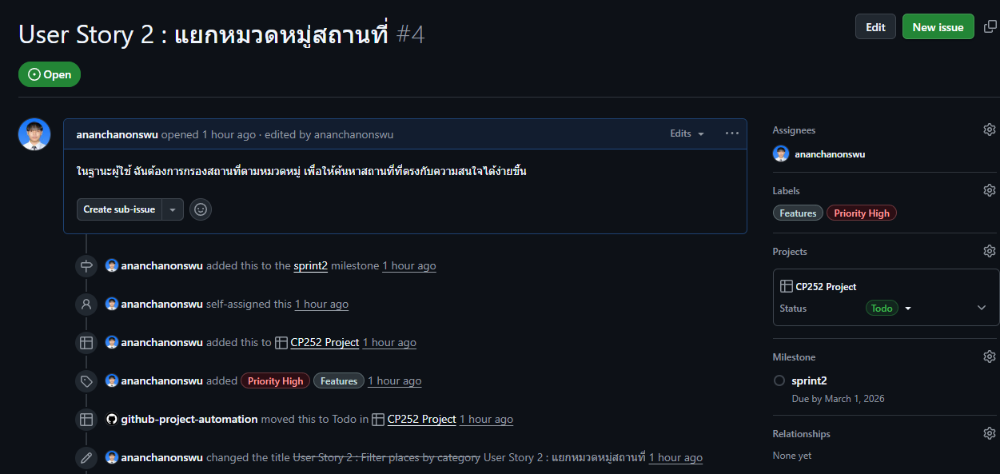

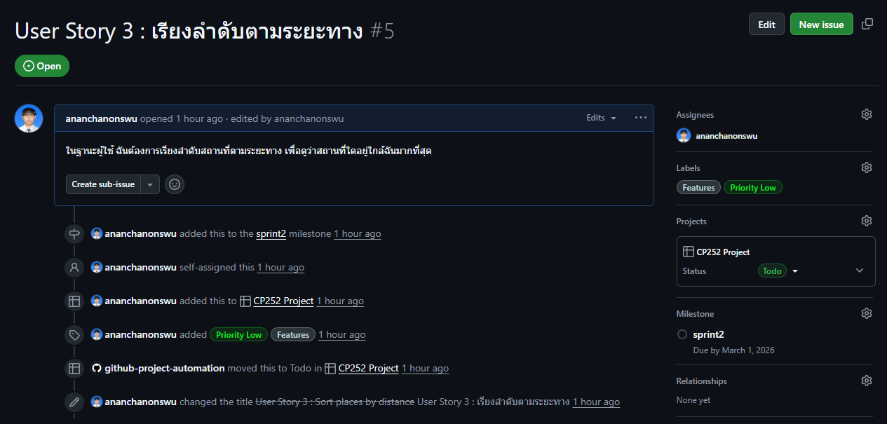

---

## 11) Sprint backlog


---

### sprint 1 (Due Feb 5th)

เป้าหมาย

- เพื่อวิเคราะห์ความต้องการของระบบและจัดทำเอกสารที่เกี่ยวข้องก่อนเริ่มพัฒนาระบบจริง

Issue ที่อยู่ใน Sprint 1 :

- ทำ Report และกำหนด Requirement

 

---
## 12) New functional/non-functional requirement
### Functional Requirements (FR)**
- **FR-01** ผู้ใช้สามารถเลือกจุดตั้งต้นและกำหนดรัศมีค้นหาได้  
- **FR-02** ระบบสามารถค้นหาและแสดงสถานที่ภายในรัศมีที่กำหนดได้  
- **FR-03** ระบบสามารถแยกผลลัพธ์ตามหมวดหมู่ (โรงแรม/ร้านอาหาร/สนามกีฬา/ท่องเที่ยว) ได้  
- **FR-04** ผู้ใช้สามารถกรองและเรียงผลลัพธ์ตามระยะทางได้  
- **FR-05** ผู้ใช้สามารถดูรายละเอียดสถานที่และเปิดดูตำแหน่งบนแผนที่ได้  
- **FR-06** ผู้ใช้สามารถบันทึก (Bookmark) และยกเลิก Bookmark ได้  
- **FR-07** ผู้ใช้สามารถสร้างทริป 1 วัน โดยเลือกหลายสถานที่ได้  
- **FR-08** ผู้ใช้สามารถกำหนดเวลาเริ่มต้น–สิ้นสุดของแต่ละสถานที่ในทริปได้  
- **FR-09** ระบบต้องตรวจสอบและแจ้งเตือนเมื่อเวลาของกิจกรรมในทริปทับซ้อนกัน  
- **FR-10** ระบบสามารถแสดงทริปเป็น timeline หรือปฏิทินรายวันได้
### Non-Functional Requirements (NFR)**
- **NFR-01 Usability:** ผู้ใช้สามารถสแกนสถานที่ได้ภายในไม่เกิน 3–4 ขั้นตอน  
- **NFR-02 Performance:** แสดงผลการสแกนภายใน 2 วินาที เมื่อจำนวนข้อมูลอยู่ในขอบเขตที่กำหนด  
- **NFR-03 Accuracy:** การคำนวณระยะทางต้องถูกต้องตามสูตรที่ใช้ (เช่น Haversine Formula)  
- **NFR-04 Reliability:** ผลลัพธ์ต้องสม่ำเสมอเมื่อใช้ input เดิม และการตรวจสอบเวลาทับซ้อนต้องเชื่อถือได้  
- **NFR-05 Maintainability:** โครงสร้างระบบแยกโมดูล (Scan / Filter / Trip / Bookmark) เพื่อให้แก้ไขและต่อยอดได้ง่าย  
- **NFR-06 Compatibility:** ระบบสามารถใช้งานผ่านเว็บเบราว์เซอร์ทั่วไปได้
## 13) Architectural design
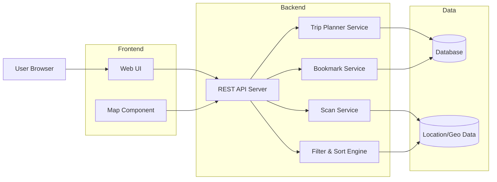
```mermaid
flowchart LR
    User[User Browser]

    subgraph Frontend
        UI[Web UI]
        Map[Map Component]
    end

    subgraph Backend
        API[REST API Server]
        Scan[Scan Service]
        Trip[Trip Planner Service]
        Bookmark[Bookmark Service]
        Filter[Filter & Sort Engine]
    end

    subgraph Data
        DB[(Database)]
        Geo[(Location/Geo Data)]
    end

    User --> UI
    UI --> API
    Map --> API

    API --> Scan
    API --> Trip
    API --> Bookmark
    API --> Filter

    Scan --> Geo
    Filter --> Geo

    Trip --> DB
    Bookmark --> DB
```
Use Case Diagram

Actors
 • User (ผู้ใช้งานทั่วไป)

Mermaid: Use Case Diagram 

```mermaid
flowchart TB
  user([User])

  uc1((Select location & radius))
  uc2((Scan nearby places))
  uc3((Filter & sort results))
  uc4((View place detail))
  uc5((Pin/Unpin place))
  uc6((View pinned places))
  uc7((Create 1-day trip))
  uc8((Set time for trip activities))
  uc9((Validate time conflicts))
  uc10((View trip timeline/calendar))

  user --> uc1
  user --> uc2
  user --> uc3
  user --> uc4
  user --> uc5
  user --> uc6
  user --> uc7
  user --> uc8
  user --> uc9
  user --> uc10
```

Other Designs (Optional but Recommended)

A) Sequence Diagram: Nearby Scan
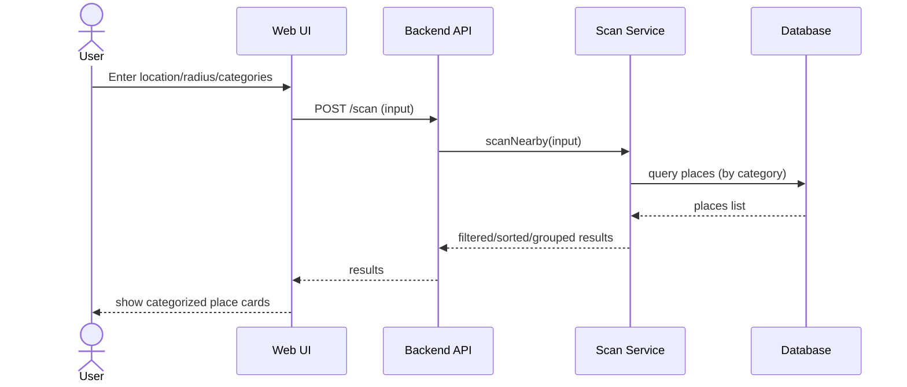
```mermaid
sequenceDiagram
  actor User
  participant UI as Web UI
  participant API as Backend API
  participant S as Scan Service
  participant DB as Database

  User->>UI: Enter location/radius/categories
  UI->>API: POST /scan (input)
  API->>S: scanNearby(input)
  S->>DB: query places (by category)
  DB-->>S: places list
  S-->>API: filtered/sorted/grouped results
  API-->>UI: results
  UI-->>User: show categorized place cards
```
B) Sequence Diagram: Trip Validate (กันเวลาทับซ้อน)
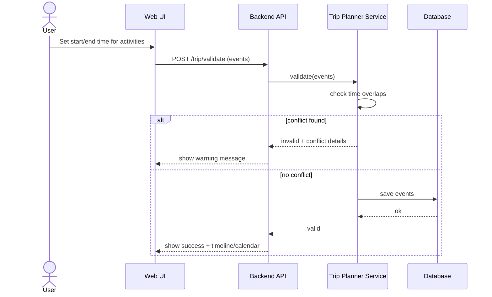
```mermaid
sequenceDiagram
  actor User
  participant UI as Web UI
  participant API as Backend API
  participant T as Trip Planner Service
  participant DB as Database

  User->>UI: Set start/end time for activities
  UI->>API: POST /trip/validate (events)
  API->>T: validate(events)
  T->>T: check time overlaps
  alt conflict found
    T-->>API: invalid + conflict details
    API-->>UI: show warning message
  else no conflict
    T->>DB: save events
    DB-->>T: ok
    T-->>API: valid
    API-->>UI: show success + timeline/calendar
  end
```

C) Activity Diagram: Trip Planner Flow
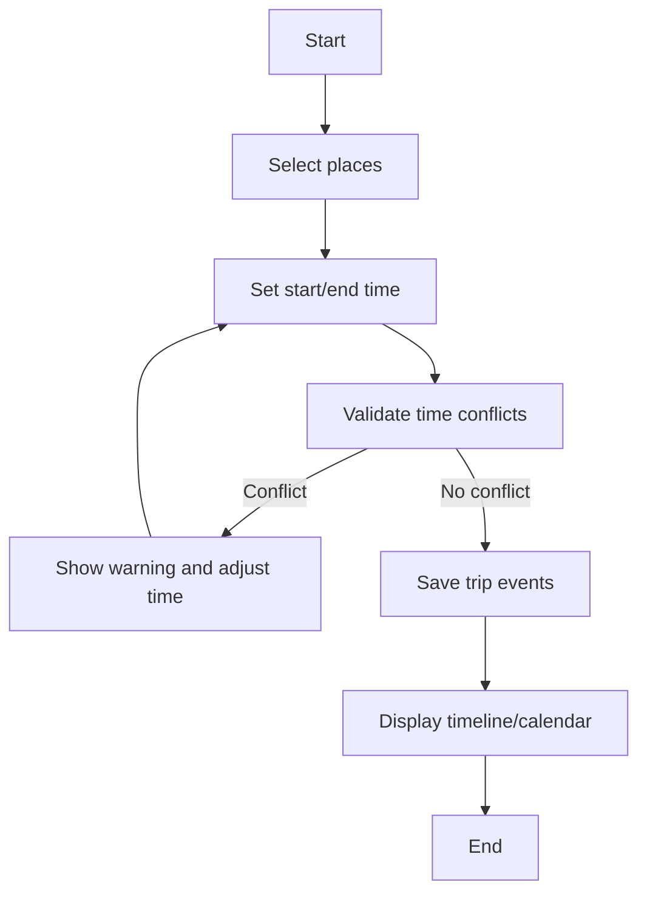
```mermaid
flowchart TD
  A[Start] --> B[Select places]
  B --> C[Set start/end time]
  C --> D[Validate time conflicts]
  D -->|Conflict| E[Show warning and adjust time]
  E --> C
  D -->|No conflict| F[Save trip events]
  F --> G[Display timeline/calendar]
  G --> H[End]
```
## 14) Website screenshot

### Page 1
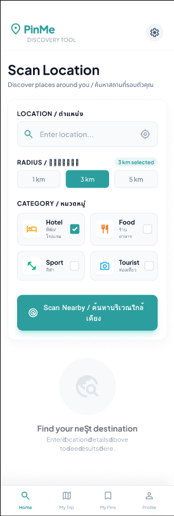

### Page 2
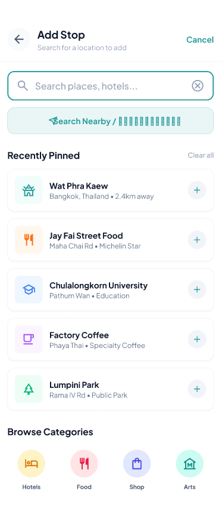

### Page 3


### Page 4


### Page 5
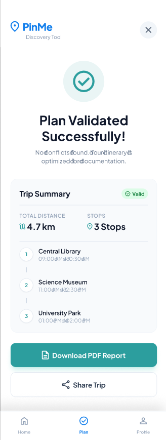

### page 6
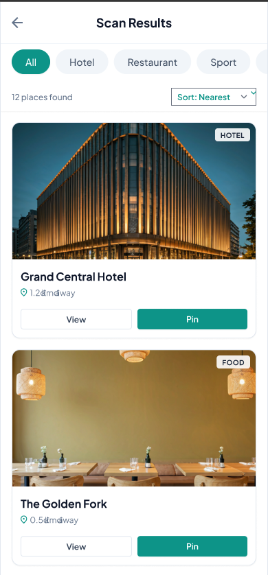

### page 7
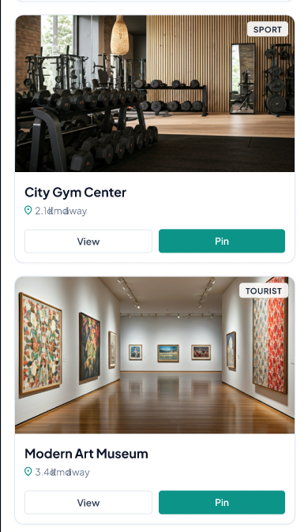

## System Workflow

### 1)Scan (การค้นหาสถานที่ใกล้เคียง)

#### ขั้นตอนที่ 1: ผู้ใช้กำหนดข้อมูล
ผู้ใช้กรอกข้อมูลดังต่อไปนี้:
- ตำแหน่งเริ่มต้น (Location)
- ระยะทางที่ต้องการค้นหา (เช่น 1, 3, 5 กิโลเมตร)
- หมวดหมู่ที่สนใจ (Hotel / Restaurant / Sport / Tourist)

#### ขั้นตอนที่ 2: ระบบประมวลผล
ระบบจะดำเนินการดังนี้:
- รับค่าพิกัด (Latitude, Longitude)
- คำนวณระยะทางระหว่างจุดตั้งต้นกับสถานที่ในฐานข้อมูล
- กรองเฉพาะสถานที่ที่อยู่ภายในรัศมีที่กำหนด
- แยกผลลัพธ์ตามหมวดหมู่
- เรียงลำดับตามระยะทาง (หากผู้ใช้เลือก)

#### ขั้นตอนที่ 3: แสดงผลลัพธ์
ระบบจะแสดง:
- รายชื่อสถานที่
- หมวดหมู่
- ระยะทางจากจุดตั้งต้น
- ปุ่ม View Detail และ Pin

---

### 2) Place Detail (ดูรายละเอียดสถานที่)

เมื่อผู้ใช้กดดูรายละเอียด:

ระบบจะ:
- ดึงข้อมูลสถานที่จากฐานข้อมูล
- แสดงชื่อ หมวดหมู่ ที่อยู่ และระยะทาง
- แสดงตำแหน่งบนแผนที่ (Map Preview)

ผู้ใช้สามารถ:
- ปักหมุด (Pin)
- เพิ่มสถานที่ลงในทริป

---

### 3) Pin / Bookmark (การปักหมุด)

เมื่อผู้ใช้กดปักหมุด:

- ระบบบันทึกข้อมูลลงในตาราง bookmarks
- ผู้ใช้สามารถดูรายการสถานที่ที่ปักหมุดไว้ในหน้า My Pins
- สามารถลบออกจากรายการ หรือเพิ่มเข้า Trip Planner

---

### 4) Mini Trip Planner (การสร้างทริป 1 วัน)

#### ขั้นตอนที่ 1: เลือกสถานที่
ผู้ใช้สามารถเลือกหลายสถานที่จาก:
- ผลการค้นหา
- รายการที่ปักหมุด

#### ขั้นตอนที่ 2: กำหนดเวลา
ผู้ใช้กำหนด:
- เวลาเริ่มต้น (Start Time)
- เวลาสิ้นสุด (End Time)

#### ขั้นตอนที่ 3: ระบบตรวจสอบความถูกต้อง
ระบบจะ:
- ตรวจสอบว่าช่วงเวลาของกิจกรรมทับซ้อนกันหรือไม่
- หากมีการทับซ้อน → แสดงข้อความแจ้งเตือน
- หากไม่มีการทับซ้อน → บันทึกข้อมูลลงฐานข้อมูล

#### ขั้นตอนที่ 4: แสดงผลแบบ Timeline
ระบบจะแสดง:
- ลำดับกิจกรรมเรียงตามเวลา
- รูปแบบปฏิทินหรือ Timeline รายวัน

---

## Core Processing Logic

### 1) Distance Calculation
ระบบใช้สูตรคำนวณระยะทางระหว่างพิกัด (เช่น Haversine Formula)  
เพื่อคัดกรองสถานที่ที่อยู่ภายในรัศมีที่กำหนด

---

### 2) Time Conflict Validation
ระบบจะ:
- ตรวจสอบกิจกรรมทั้งหมดภายในทริปเดียวกัน
- เปรียบเทียบช่วงเวลาเริ่มต้นและสิ้นสุด
- หากพบช่วงเวลาทับซ้อนกัน → แสดงข้อความ Error และไม่บันทึกข้อมูล

## Summary Retrospective Phase 2

[Retrospective Video Phase 2](https://youtu.be/1FdYNd2XVNs)

ใน Phase 2 ได้ออกแบบระบบ (Architecture, Use Case, Workflow) และพัฒนา Prototype ด้วย Figma และเว็บไซต์เบื้องต้น ทำให้เห็นภาพระบบชัดเจนมากขึ้นและลดความคลาดเคลื่อนจาก Phase 1

สิ่งที่ทำได้ดี: มี Prototype ช่วยให้เข้าใจตรงกันมากขึ้น และเริ่มแบ่งงานเป็นระบบ

ปัญหาที่พบ: ยังไม่คุ้นชินกับเครื่องมือบางอย่าง และมีความเข้าใจ flow บางส่วนไม่ตรงกัน

แนวทางปรับปรุง: เพิ่มการสื่อสารระหว่างทีม กำหนดมาตรฐานการทำงานให้ชัดเจน และปรับ Design ให้สอดคล้องกับ Implementation มากขึ้น

# Phase 3

## การทำงานของ Program
1. HTTP Methods ที่ใช้ (GET และ POST)

- GET Methods (การดึงข้อมูล):
	- Backend Serve Files: Server (server.js) ใช้รับ request แบบ GET สำหรับให้บริการ	ไฟล์ Static ของ Frontend ทั้งหมดแบบอัตโนมัติ (เช่น /, index.html, js/..., 	css/...)
	- External API Call: Backend ทำการสร้าง request แบบ GET เพื่อไปขอข้อมูลจาก 	SerpAPI (Google Maps Engine)
- POST Methods (การส่งข้อมูล):
	- มี 1 Method คือ /scan: เป็น Frontend API Endpoint ที่รับข้อมูลพิกัด 	(Latitude/Longitude), รัศมี (Radius) และ หมวดหมู่ (Category) จากผู้ใช้ (Frontend) 	เพื่อส่งให้ Backend ประมวลผลค้นหาสถานที่
2. การใช้ Template

- No Server-Side Templating: โปรเจคนี้ ไม่ได้ใช้ Template Engine บน Backend (เช่น EJS หรือ Pug)
- Client-Side Rendering (DOM Manipulation): ใช้ Client-Side Rendering สถาปัตยกรรมแบบ 	Single Page Application (SPA) โครงสร้างหลักอยู่ใน index.html และใช้ JavaScript 	(front_end/js/app.js) รูปแบบ **Template Literals (Backticks )** ในการสร้าง 	HTML Component แบบไดนามิก (เช่น การสร้างการ์ดผลลัพธ์result-card` แต่ละใบ และสร้าง	รายการ Trip Planner) ตามข้อมูล JSON ที่ได้รับกลับมาจาก Backend
3. การเรียก API (API Integration)
- Internal API: Frontend สื่อสารกับ Backend ผ่านการเรียก fetch แบบ POST ไปยัง Endpoint /scan
- External API (Third-party): Backend เมื่อได้รับข้อมูลจากผู้ใช้ จะทำการเรียก SerpAPI (Google Maps API) โดยส่ง Parameters ไปยัง https://serpapi.com/search.json แบบ GET Request เพื่อดึงข้อมูลสถานที่รอบตัว แล้วจึงนำ Response ที่เป็น JSON มากรอง (Filter) และเรียบเรียงใหม่ (Normalize) ก่อนส่งข้อมูลง่ายๆ กลับไปให้ Frontend

4. การคำนวณที่สำคัญ (Calculations)
- Haversine Formula (การคำนวณระยะทางบนพื้นผิวโลก):
	- เป็น Core Logic สำคัญที่สุดของแอป อยู่ในโหนด Backend (server.js และ 	models/Place.js)
	- เนื่องจาก API ภายนอกอาจคืนค่าสถานที่ที่ไกลเกินกำหนด โปรแกรมจึงนำพิกัดเส้นรุ้งเส้นแวงของจุด	ศูนย์กลาง (ผู้ใช้) และตำแหน่งสถานที่เป้าหมาย มาเข้าสูตร Haversine คำนวณออกมาเป็นระยะทาง	แบบ "กิโลเมตร" ที่แม่นยำ เพื่อใช้ในการกรอง (Filter) สถานที่ให้อยู่ใน "รัศมี (Radius)" ที่ผู้ใช้	กำหนด
- Time & Overlap Calculation (ระบบวางแผนทริป):
	- แปลง String รูปแบบเวลา HH:MM ให้เป็นหน่วย นาที (Minutes)
	- คำนวณระยะเวลา (Duration) และมี Algorithm ในการเช็คเวลาที่ทับซ้อนกัน (Overlap 	Detection) ของกิจกรรมที่ผู้ใช้พยามยามแอดเข้าใน Timeline ของวัน

5. Graph หรือ การแสดงผลเชิงภาพ (Visualizations)
- ไม่มีกราฟแบบดั้งเดิม (เช่น กราฟแท่ง กราฟเส้น)
- ใช้ Interactive Map (แผนที่แบบตอบโต้ได้) ดึงจาก Leaflet.js และ OpenStreetMap (OSM) แทน Graph หลัก
- มีการนำข้อมูลที่ได้มาพล็อต (Plot) ลงบนแกน X/Y ของพิกัดแผนที่:
	- วาดรัศมีวงกลม (Radius Circle) ปรับขนาดตามกิโลเมตร
	- พล็อตหมุด (Place Markers) สีและไอคอนแยกตามหมวดหมู่
	- พล็อตหมุดตำแหน่งผู้ใช้ปัจจุบันแบบมี Animation (Pulsing Marker)

## Test Case
### ตาราง Unit Test Cases

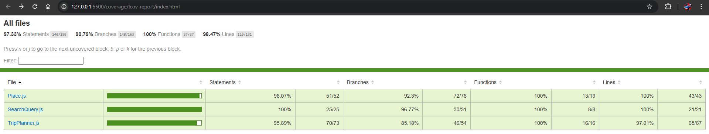

ตารางด้านบนแสดงกรณีทดสอบ (Test Cases) จำนวน 10 กรณี ที่กลุ่มของเราได้ออกแบบมาเพื่อตรวจสอบความถูกต้องของ Data Structure และ Business Logic หลักในโฟลเดอร์ model โดยแบ่งกลุ่มการทดสอบตาม Class ได้ดังนี้:

1.Place Model : เน้นทดสอบการจัดการข้อมูลสถานที่ โดยตรวจสอบว่าระบบสามารถคัดกรองพิกัด (Latitude/Longitude) ที่เป็นไปได้จริงเท่านั้น และสามารถแปลงหมวดหมู่สถานที่ (Category) จาก API ให้อยู่ในรูปแบบมาตรฐานของระบบได้ (เช่น แปลงตัวพิมพ์ใหญ่-เล็ก หรือดักจับหมวดหมู่ที่ไม่รู้จัก)

2.SearchQuery Model : ตรวจสอบความถูกต้องของพารามิเตอร์ก่อนส่งไปค้นหากับ API ภายนอก โดยระบบต้องสามารถดักจับ (Validate) กรณีที่ผู้ใช้ไม่ได้ระบุพิกัด หรือระบุพิกัดผิดรูปแบบ เพื่อป้องกันไม่ให้เกิด Error ในฝั่ง Backend

3.TripPlanner Model : เป็นหัวใจสำคัญของฟีเจอร์จัดทริป จึงเน้นทดสอบลอจิกการคำนวณเวลา โดยทดสอบทั้งการแปลง String เป็นนาที, การแปลงนาทีกลับเป็นรูปแบบเวลา (HH:MM) และการหาระยะเวลาระหว่างช่วงเวลา รวมถึงมีการทดสอบกรณีขอบ (Edge Cases) เช่น การกรอกเวลาที่เกิน 24 ชั่วโมง ซึ่งระบบต้องคืนค่าเป็น NaN ได้อย่างถูกต้อง

การทดสอบทั้ง 10 กรณีนี้ ครอบคลุมทั้งกรณีที่ข้อมูลถูกต้อง (Happy Path) และกรณีที่ข้อมูลผิดปกติ (Error Handling) เพื่อให้มั่นใจว่ารากฐานข้อมูลของระบบมีความเสถียรและพร้อมนำไปใช้งานต่อในส่วนอื่นๆ

## ตัวอย่าง Test Case Code

### ตัวอย่างที่ 1: การทดสอบ Haversine Formula (จากไฟล์ Place.test.js)
ใช้ทดสอบว่าระบบสามารถคำนวณระยะทางจาก Latitude/Longitude 2 จุดบนโลกได้แม่นยำหรือไม่

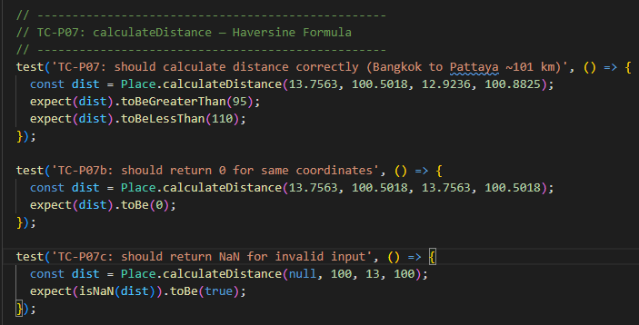

### ตัวอย่างที่ 2: การทดสอบเพิ่มกิจกรรมและเช็คเวลาทับซ้อน (จากไฟล์ TripPlanner.test.js)
ใช้ทดสอบว่าคลาสผู้เชี่ยวชาญการจัดทริป สามารถตรวจจับว่าคุณไม่สามารถเพิ่มกิจกรรมที่เวลาทับซ้อนกับกิจกรรมอื่นที่มีอยู่แล้วได้


### ตัวอย่างที่ 3: การทดสอบ Validation (จากไฟล์ SearchQuery.test.js)
ใช้ทดสอบว่าผู้ใช้อาจเผลอป้อน Latitude หรือ Longitude ผิดพลาด ระบบต้องจับผิดได้


## Test Coverage Report

จากการรัน Unit Test ด้วย Framework Jest เพื่อตรวจสอบการทำงานของ Data Structure และ Business Logic หลักในโฟลเดอร์ `models` (ประกอบด้วยคลาส Place, SearchQuery และ TripPlanner) 

ผลลัพธ์การรัน Coverage แสดงให้เห็นว่ากลุ่มของเรามีค่า **Statement Coverage ภาพรวมสูงถึง 97.33%** (โดยมีบางไฟล์เช่น `SearchQuery.js` สามารถทำ Coverage ได้ถึง 100%) ซึ่งผลลัพธ์นี้ผ่านเกณฑ์ที่กำหนดไว้ว่าต้องมากกว่า 80% อย่างสมบูรณ์ เป็นการยืนยันว่าโครงสร้างพื้นฐานของระบบได้รับการทดสอบอย่างครอบคลุมและมีความเสถียรสูง

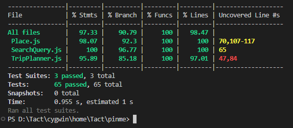

## สิ่งที่ยังไม่เสร็จสมบูรณ์ (bugs and limitations)

1. ข้อจำกัดในการรองรับเที่ยวข้ามคืน (Cross-midnight Trip Bug)
รายละเอียด: ระบบ Trip Planner ปัจจุบันมีเงื่อนไข Validation ว่า EndTime ต้องมากกว่า StartTime เสมอ `if (start >= end)` ทำให้ผู้ใช้ไม่สามารถเพิ่มกิจกรรมที่ลากยาวผ่านช่วงเที่ยงคืนได้ (เช่น เริ่ม 23:00 น. สิ้นสุด 02:00 น. ของอีกวัน) 
ผลกระทบ: ระบบจะมองว่าเป็น Error "เวลาสิ้นสุดต้องมากกว่าเวลาเริ่ม"

2. ข้อมูลทริปสูญหายเมื่อรีเฟรชหน้าเว็บ (No Data Persistence)
รายละเอียด: สถานะการปักหมุด (Pinned places) และรายการกิจกรรมวางแผนทริป (Trip Planner) ปัจจุบันถูกจัดเก็บอยู่ในหน่วยความจำชั่วคราว (In-memory Array) ของ JavaScript 
ผลกระทบ: หากผู้ใช้กดรีเฟรชหน้าเว็บ (F5) หรือปิดเบราว์เซอร์ ข้อมูลแผนการเดินทางทั้งหมดจะสูญหายเนื่องจากยังไม่ได้เชื่อมต่อกับ Database หรือ LocalStorage

3. ขาดระบบแบ่งหน้าผลลัพธ์ (Missing Pagination)
รายละเอียด:API ค้นหาสถานที่ (SerpAPI) อาจมีการจำกัดการคืนค่าผลลัพธ์ต่อ 1 Request (เช่น คืนค่ามาแค่ 20 สถานที่แรก) 
ผลกระทบ: ปัจจุบันหน้า UI ยังไม่รองรับระบบ "โหลดเพิ่มเติม (Load More)" หรือ Pagination ทำให้ผู้ใช้ไม่สามารถดูสถานที่ทั้งหมดในหมวดหมู่นั้นๆ ได้หากมีจำนวนมาก

4. ความราบรื่นในการขอสิทธิ์ GPS (Geolocation Edge Case)
รายละเอียด: หากผู้ใช้ปฎิเสธการให้สิทธิ์เข้าถึงตำแหน่ง (Location Permission) ในครั้งแรก ระบบจะแสดง Error อย่างถูกต้อง 
ผลกระทบ: หากผู้ใช้ไปเปลี่ยนการตั้งค่าอนุญาตในภายหลัง ผู้ใช้จำเป็นต้องรีเฟรชหน้าเว็บใหม่ทั้งหมด (Hard Refresh) เพื่อให้ระบบตรวจจับสิทธิ์ใหม่ เนื่องจากยังไม่มีปุ่ม "ลองเชื่อมต่อ GPS อีกครั้ง (Retry GPS)"

5. การจัดการข้อผิดพลาดจาก External API (Third-party API Error Handling)
รายละเอียด: หาก Quota ของ SerpAPI หมด หรือรหัส API Key มีปัญหา ระบบ Backend จะไม่สามารถดึงข้อมูลได้ 
ผลกระทบ: แม้จะมีการทำ Try-Catch ไว้ แต่ Error Message ที่ส่งไปให้ Frontend อาจจะยังเป็น Error ทั่วไป (เช่น "เกิดข้อผิดพลาดในการเชื่อมต่อ") แทนที่จะระบุชัดเจนว่า "ระบบ API ภายนอกขัดข้อง"

## Website Screenshot

หน้าหลักของ website :

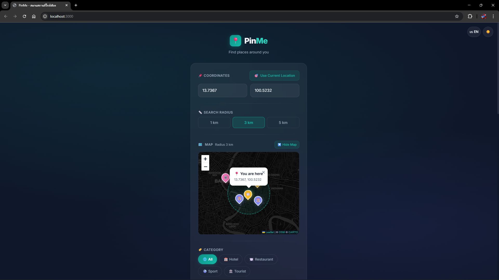

ตัว website สามารถเปลี่ยน Theme ได้ (มี Light theme กับ Dark theme) และสามารถเปลี่ยนภาษาได้ (ภาษาไทย TH และ English US)

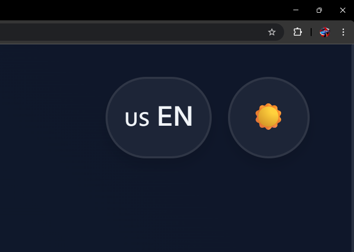

หน้า Website ที่เปลี่ยน Theme เป็น Light theme :

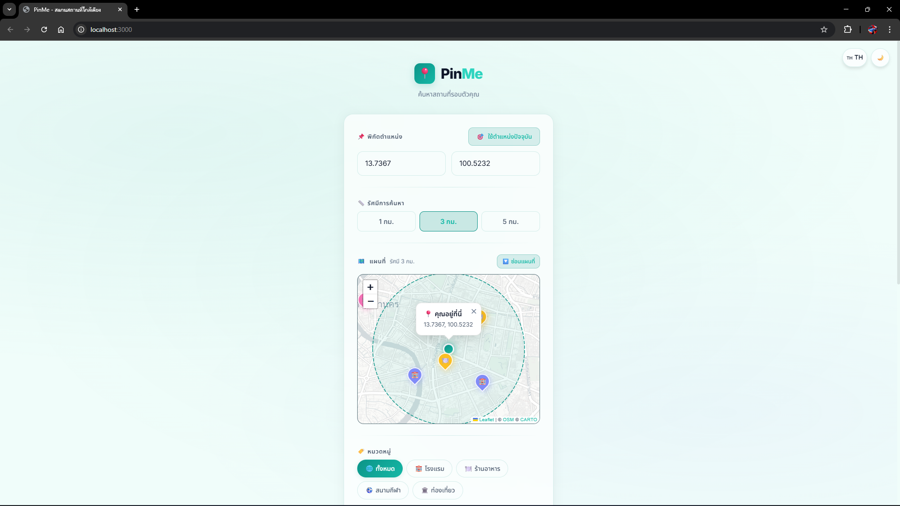

หน้า Website ที่เปลี่ยนภาษาจาก English US เป็น ภาษาไทย :

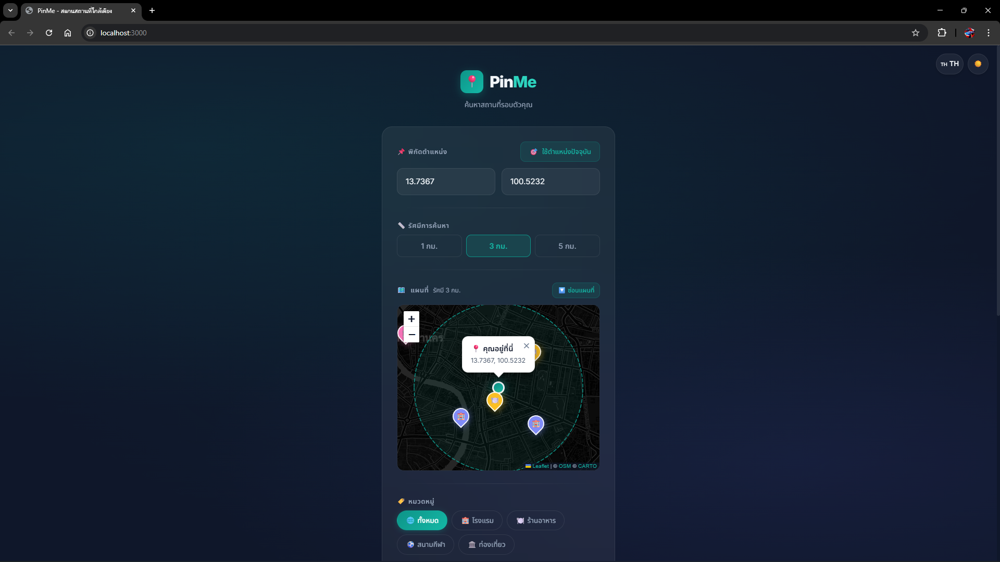

ในหน้า Website จะแสดงพิกัดตำแหน่งและสามารถเลือกพิกัดปัจจุบันที่เราอยู่ได้ โดยพิกัดจะแสดงเป็น ละติจูด ลองจิจูด และสามารถเลือกรัศมีการค้นหาสถานที่ต่างๆได้ เช่น 3 กม.

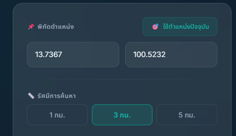

ในหน้าของ Website จะมีแผนที่แสดงตำแหน่งของตัวเรา , สถานที่ต่างๆในบริเวณของเรา และ รัศมีการค้นหาที่เราเลือกไว้ข้างต้น โดยตัวแผนที่สามารถกดบวกและลบเพื่อขยายขนาดของแผนที่ได้ และสามารถกดซ่อนแผนที่ได้

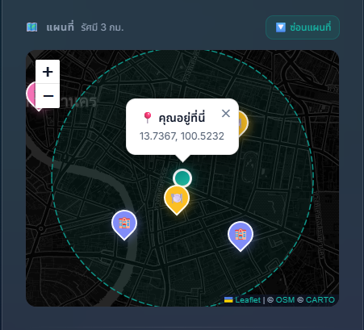

สามารถเลือกหมวดหมู (category) ของสถานที่ได้ และมีปุ่มสแกนเพื่อค้นหาสถานที่ที่อยู่ภายในบริเวณรัศมีที่เราเลือกไว้ได้

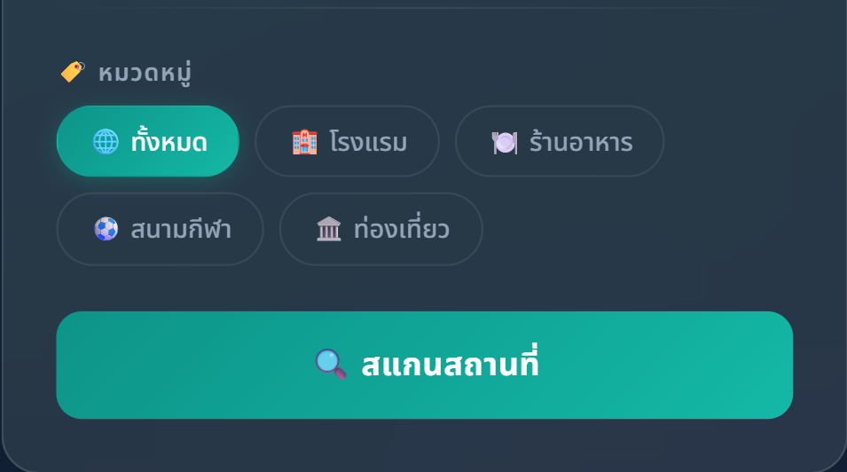

สามารถกำหนดแผนการเดินทางเบื้องต้นของเราได้ โดบการกำหนดชื่อสถานที่ จากนั้นก็เลือกเวลาที่เราจะเดินทางกี่โมงถึงกี่โมง

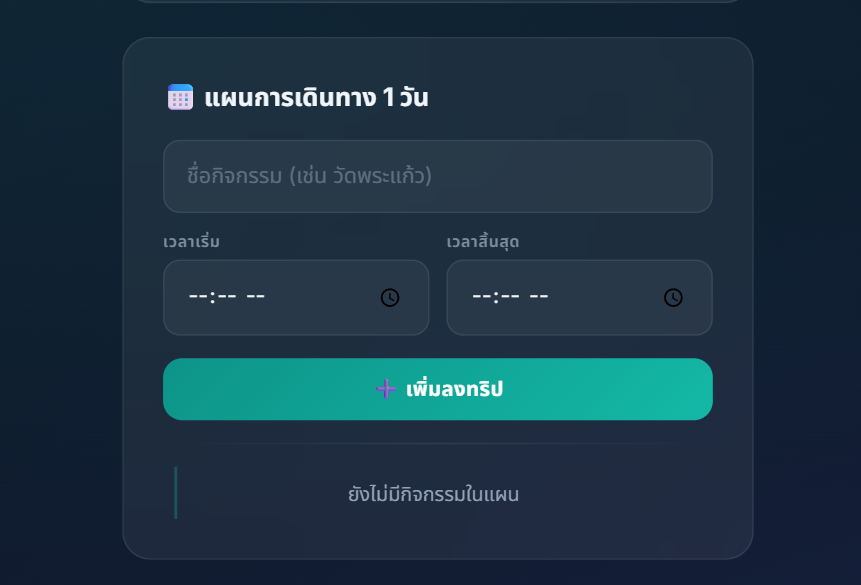

ตัวอย่าง :

| Metric | ผลลัพธ์ |
|---|---|
| CI Pipeline Status | ✅ Passed สบายฉลุย |
| Total Tests Run | 65 Unit Tests & 5 UI E2E Tests |
| Code Coverage Range | 97.33% Statements / 90.79% Branches / 100% Functions |
| UI Functionality | 100% Passed (Form, Maps, Validation, Favorites) |

หลังจากที่เรากดบันทึกไว้ :

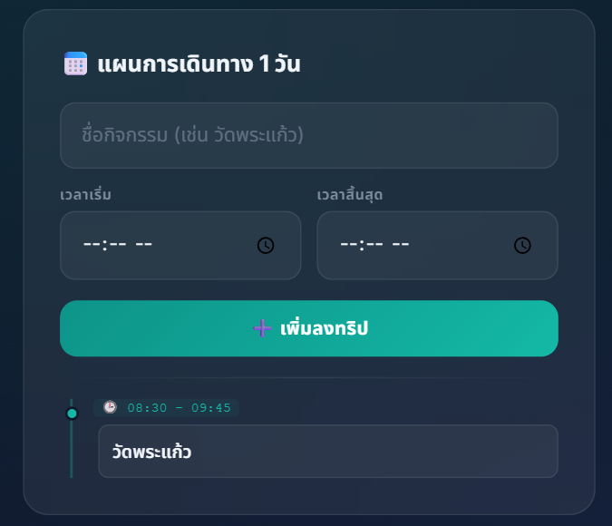

หลังจากที่เราได้สแกนเพื่อค้นหาสถานที่โดยรอบแล้ว ตัว website ก็จะแสดงผลลัพธ์โดยมีสถานที่ต่างๆออกมา ตามหมวดหมู่ที่เราเลือกไว้ข้างต้น

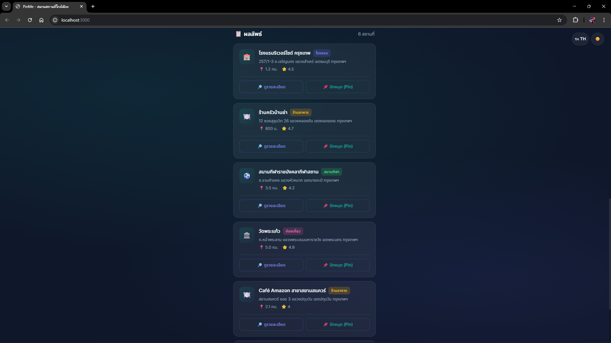

สามารถเลือกดูลายละเอียดของสถานที่ต่างได้และสามารถกดปักหมุดได้

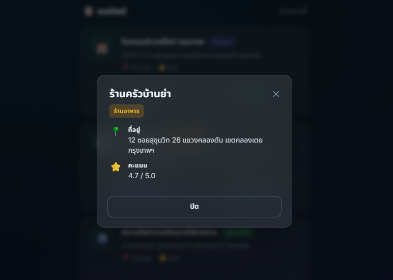

## สิ่งเปลี่ยนแปลงจากรายงาน Phase 1 และ 2 และเหดุผลที่เปลี่ยน
ในระหว่างการพัฒนาโปรแกรมจริงใน Phase 3 ทางกลุ่มได้พบข้อจำกัดและได้ปรับปรุงรายละเอียดบางส่วนให้ต่างไปจากที่เคยออกแบบไว้ใน Phase 1 และ 2 ดังนี้:

1. การปรับหน้าจอผู้ใช้งาน (UI/UX) นอกเหนือจาก Figma: * สิ่งที่เปลี่ยน: เพิ่มฟีเจอร์การสลับ Theme (Light/Dark Mode) และการเปลี่ยนภาษา (Thai/English) ซึ่งไม่มีใน Prototype เดิม

	- เหตุผล: เพื่อยกระดับประสบการณ์ผู้ใช้ (User Experience) ให้ดียิ่งขึ้น และตอบโจทย์ Non-Functional Requirement (NFR-01 Usability) ให้ผู้ใช้สามารถปรับแต่งหน้าเว็บตามความถนัดได้

2. การเปลี่ยนรูปแบบการเชื่อมต่อข้อมูล (API Integration):

	- สิ่งที่เปลี่ยน: จากเดิมที่ออกแบบไว้ว่าอาจจะใช้ Mock Database สลับมาใช้การดึงข้อมูลสถานที่จริงผ่าน SerpAPI (Google Maps Engine) * เหตุผล: เพื่อให้ระบบค้นหาสถานที่ (Scan) ได้ข้อมูลที่แม่นยำ อัปเดตแบบ Real-time และครอบคลุมหมวดหมู่สถานที่ได้ตรงตามที่ออกแบบไว้ (FR-02 และ FR-03)

3. การเพิ่มความเข้มงวดของ Logic ใน Trip Planner:

	- สิ่งที่เปลี่ยน: เพิ่มอัลกอริทึมในการตรวจจับเวลาทับซ้อน (Time Conflict Validation) ที่ซับซ้อนขึ้นในคลาส TripPlanner

	- เหตุผล: จากตอนแรกที่แค่ออกแบบให้เรียงลำดับเวลาธรรมดา เมื่อเขียนโค้ดจริงพบว่าผู้ใช้อาจกรอกเวลาผิดพลาดหรือกรอกเวลาซ้อนทับกัน จึงต้องเขียนเงื่อนไขดักจับ (Error Handling) ให้รัดกุมขึ้น เพื่อไม่ให้ระบบเกิดข้อผิดพลาดในการแสดงผล Timeline

## อธิบายกระบวนการทำงาน (Process, Methods, and Tools ที่เพิ่มเติมจาก Phase 1 และ 2)
ใน Phase 3 ซึ่งเป็นช่วงของการเขียนโค้ดจริง (Implementation) และการทดสอบระบบ (Testing) ทางกลุ่มได้ขยายกระบวนการทำงานและนำเครื่องมือใหม่ๆ เข้ามาช่วยบริหารจัดการ ดังนี้:

1. กระบวนการทดสอบอัตโนมัติ (Automated Unit Testing)

	- Methods: นำแนวคิดการทดสอบระดับโครงสร้างข้อมูลมาใช้ โดยเน้นทดสอบ Business Logic ที่สำคัญที่สุดก่อน (เช่น สูตร Haversine และการคำนวณเวลา)

	- Tools: ใช้ Jest เป็น Framework ในการเขียน Script ทดสอบโฟลเดอร์ model จนได้ Statement Coverage 100% เพื่อการันตีว่ารากฐานของโค้ดทำงานได้ถูกต้องแน่นอน

2. การวิเคราะห์ประสิทธิภาพโค้ด (Code Profiling)

	- Methods: มีการประเมินคุณภาพของโค้ดก่อนนำไปรวมกับส่วนอื่น โดยแบ่งเป็นการวิเคราะห์โครงสร้างโดยไม่รันโปรแกรม (Static) และการวิเคราะห์การกินทรัพยากรขณะใช้งานจริง (Dynamic) เพื่อเก็บเป็นค่า Baseline ไว้ใช้ปรับปรุงใน Phase 4

	- Tools: ใช้ ESLint สำหรับ Static Profiling และใช้ Chrome DevTools (แท็บ Performance และ Memory) สำหรับ Dynamic Profiling

3. การจัดการข้อผิดพลาด (Bug Management)

	- Methods: เมื่อทีมพบข้อผิดพลาดจากการเขียนโค้ด (เช่น บั๊กการข้ามเที่ยงคืน หรือ บั๊กข้อมูลหายเมื่อรีเฟรช) ทีมจะไม่แก้โค้ดสะเปะสะปะ แต่จะทำการบันทึกปัญหา (Log Issue) ไว้ในระบบ เพื่อให้ทุกคนในทีมรับทราบและจัดลำดับความสำคัญ (Prioritize) ว่าบั๊กไหนควรแก้ก่อนหรือหลัง

	- Tools: ใช้ฟีเจอร์ GitHub Issues (หรือ GitHub Projects) ในการเปิดตั๋วแจ้งบั๊ก (Issue Tracking) เพื่อตรวจสอบสถานะการแก้ไข มอบหมายงานให้คนในทีม และทำการรีวิวก่อนปิด Issue

4. การควบคุมและตรวจสอบบิลด์ (Monitor Build & Version Control)

	- Methods: เพิ่มกฎในการทำงานร่วมกัน (Team Convention) โดยก่อนที่สมาชิกจะทำการ Push หรือ Merge โค้ดของตัวเองขึ้นไปบน Branch หลัก (Main/Master) จะต้องทำการรันคำสั่ง npm test ในเครื่องของตัวเองให้ผ่าน 100% เสียก่อน เพื่อป้องกันไม่ให้โค้ดที่พัง (Broken Code) ไปกระทบกับงานของเพื่อนร่วมทีม

	- Tools: ใช้การจัดการ Version Control ผ่าน GitHub โดยมี Visual Studio Code และ Antigravity เป็น Code Editor หลัก นอกจากนี้ยังมีการประยุกต์ใช้ AI อย่าง Claude AI และ Google Gemini AI ในการช่วยวิเคราะห์โครงสร้างโค้ดและหาวิธีแก้ปัญหา (Debug) เบื้องต้น

## Retrospective Phase 3

[Retrospective Video Phase 3](https://youtu.be/MVU9iQHDngI)

หลังจากการพัฒนาระบบใน Phase 3 ทางกลุ่มได้ร่วมกันประชุมทบทวนการทำงาน ทั้งในมุมมองของตัวระบบ (Technical) และกระบวนการทำงานร่วมกันในทีม (Team Process) โดยสามารถสรุปประเด็นสำคัญได้ดังนี้:

1. สิ่งที่ทำได้ดี (What went well)

	- การทำงานร่วมกันและการแบ่งงาน : สมาชิกในทีมมีการสื่อสารที่สม่ำเสมอและแบ่งงานกันตามความถนัด (เช่น ฝั่ง Frontend, Backend และฝั่ง Testing) ทำให้งานเดินหน้าได้เร็ว นอกจากนี้เมื่อมีสมาชิกติดปัญหา (Blocker) ก็มีการเข้ามาช่วยกัน Debug หรือวิเคราะห์โค้ดร่วมกัน ทำให้ผ่านอุปสรรคไปได้

	- การบรรลุเป้าหมายการพัฒนา: สามารถสร้าง Website ออกมาให้เป็น Initial Working Product ที่ใช้งานได้จริง และเชื่อมต่อ API ค้นหาสถานที่ได้ตามแผนที่วางไว้

	- คุณภาพของการทดสอบ (Testing): ประสบความสำเร็จในการทำ Automated Unit Test ด้วย Jest โดยสามารถทำ Statement Coverage ได้สูงถึง 97.33% ซึ่งสะท้อนให้เห็นว่าทีมใส่ใจกับคุณภาพของโค้ด

2. ปัญหาและอุปสรรคที่พบ (What didn't go well / Impediments):

	- ปัญหาการรวมโค้ด : เนื่องจากการทำงานพร้อมกันหลายคน บางครั้งมีการแก้ไขไฟล์เดียวกันหรือทำงานทับซ้อนกัน ทำให้เกิด Merge Conflict บน GitHub ซึ่งทีมต้องเสียเวลามานั่งไล่แก้โค้ดก่อนที่จะรวมเข้า Branch หลัก

	- ข้อจำกัดเรื่องเวลาที่ไม่ตรงกัน: สมาชิกในทีมมีเวลาว่างไม่ค่อยตรงกัน ทำให้การนัดประชุมเพื่อซิงก์อัปงาน (Sync-up) แบบพร้อมหน้าทำได้ยากในบางสัปดาห์

	- ข้อจำกัดทางเทคนิค : พบปัญหาที่ยังต้องรอการแก้ไข เช่น บั๊กการจัดทริปข้ามเที่ยงคืน (Cross-midnight) และสถานะข้อมูลทริปสูญหายเมื่อผู้ใช้กดรีเฟรชหน้าเว็บ (No Data Persistence) รวมถึงการจัดการโควต้าของ SerpAPI ที่มีจำกัด

3. แนวทางปรับปรุงใน Phase 4 (Action Items):

	- ปรับปรุงกระบวนการทำงานบน Git: กำหนดข้อตกลงในการแตก Branch ทำงานให้ชัดเจนขึ้น และแบ่งสัดส่วนโฟลเดอร์ให้ขาดจากกันเพื่อลดปัญหา Merge Conflict

	- เพิ่มการอัปเดตงานแบบสั้นๆ : หากนัดประชุมยาก จะใช้วิธีให้สมาชิกพิมพ์อัปเดตความคืบหน้าสั้นๆ ลงในกลุ่มแชท (เช่น Discord/LINE) เพื่อให้ทุกคนเห็นภาพรวมงานตรงกันตลอดเวลา

	- วางแผนเทคนิคัล: ศึกษาการใช้ LocalStorage หรือฐานข้อมูลเพื่อแก้ปัญหาข้อมูลทริปหายเมื่อรีเฟรช ดำเนินการแก้ไข Bug ข้ามเที่ยงคืนให้สมบูรณ์ และเตรียมความพร้อมสำหรับการทำระบบ CI/CD Pipeline

	- วางแผนเทคนิคัล: ศึกษาการใช้ LocalStorage หรือฐานข้อมูลเพื่อแก้ปัญหาข้อมูลทริปหายเมื่อรีเฟรช ดำเนินการแก้ไข Bug ข้ามเที่ยงคืนให้สมบูรณ์ และเตรียมความพร้อมสำหรับการทำระบบ CI/CD Pipeline

--- 

# Phase 4

## 1. ข้อมูลเดิมจาก Phase 1, 2 and 3

### 1.1 ที่มาของปัญหาและจุดประสงค์

**PinMe** เป็นเว็บแอปพลิเคชันสำหรับค้นหาสถานที่ใกล้เคียง (Location Scanner) พร้อมระบบวางแผนทริป 1 วัน (Trip Planner) โดยใช้ข้อมูลจาก Google Maps ผ่าน SerpAPI

**ปัญหา:** ผู้ใช้ต้องการค้นหาสถานที่ใกล้เคียงอย่างรวดเร็ว โดยจำแนกตามหมวดหมู่ (โรงแรม, ร้านอาหาร, สนามกีฬา, สถานที่ท่องเที่ยว) พร้อมวางแผนกิจกรรมแบบ 1 วัน

**จุดประสงค์:**
- ค้นหาสถานที่รอบตัวตามพิกัดและรัศมีที่กำหนด
- แสดงผลบนแผนที่พร้อมรายละเอียด
- ระบบ Favorites สำหรับบันทึกสถานที่โปรด
- ระบบ Trip Planner สำหรับวางแผนกิจกรรม 1 วัน (พร้อมตรวจสอบเวลาทับซ้อน)

### 1.2 Scope

**In-scope:**
- ค้นหาสถานที่จาก GPS หรือ Manual input
- กรองตามหมวดหมู่ (โรงแรม, ร้านอาหาร, สนามกีฬา, ท่องเที่ยว)
- แสดงแผนที่ Leaflet พร้อม markers
- Favorites (บันทึกสถานที่โปรดลง localStorage)
- Trip Planner (วางแผนทริป 1 วัน + overlap detection)
- รองรับ 2 ภาษา (TH/EN) และ Dark/Light theme

**Out-of-scope:**
- ระบบ Login / สมัครสมาชิก
- Backend database (ใช้ localStorage แทน)
- ระบบจองโรงแรมหรือร้านอาหาร
- Navigation หรือเส้นทาง
- แอปพลิเคชันมือถือ (Mobile App)

### 1.3 Functional Requirements

| ID | Requirement | Status |
|---|---|:---:|
| FR-01 | ค้นหาสถานที่ใกล้เคียงตามพิกัดและรัศมี | ✅ |
| FR-02 | กรองผลลัพธ์ตามหมวดหมู่ | ✅ |
| FR-03 | แสดงผลบนแผนที่ Leaflet | ✅ |
| FR-04 | ดูรายละเอียดสถานที่ (Modal) | ✅ |
| FR-05 | บันทึกสถานที่โปรด (Favorites) | ✅ |
| FR-06 | วางแผนทริป 1 วัน (Trip Planner) | ✅ |
| FR-07 | ตรวจสอบเวลาทับซ้อน (Overlap Detection) | ✅ |
| FR-08 | รองรับ 2 ภาษา (TH/EN) | ✅ |
| FR-09 | Dark/Light Theme | ✅ |
| FR-10 | GPS Geolocation | ✅ |

### 1.4 Non-Functional Requirements

| ID | Requirement | Status |
|---|---|:---:|
| NFR-01 | Response time ≤ 3 วินาที | ✅ |
| NFR-02 | รองรับ Browser หลัก (Chrome, Firefox, Safari) | ✅ |
| NFR-03 | Responsive Design | ✅ |
| NFR-04 | Backend Unit Test Coverage ≥ 90% | ✅ (97.33%) |
| NFR-05 | ใช้ HTTPS สำหรับ API calls | ✅ |
| NFR-06 | ไม่ expose API key ที่ frontend | ✅ |

### 1.5 สถาปัตยกรรมระบบ (Architecture)

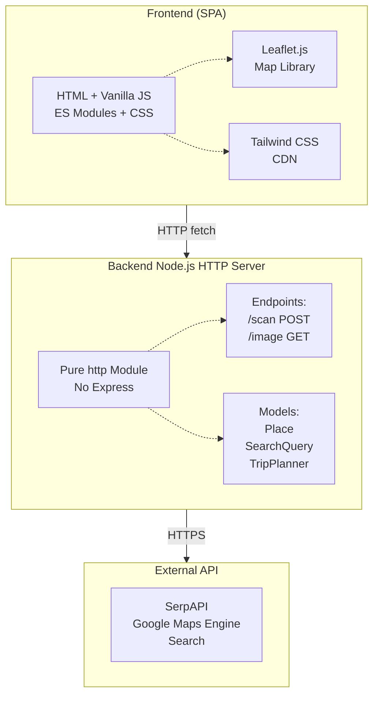
```mermaid
graph TB
    subgraph Frontend["Frontend (SPA)"]
        HTML["HTML + Vanilla JS<br/>ES Modules + CSS"]
        Leaflet["Leaflet.js<br/>Map Library"]
        Tailwind["Tailwind CSS<br/>CDN"]
    end

    subgraph Backend["Backend Node.js HTTP Server"]
        Server["Pure http Module<br/>No Express"]
        Endpoints["Endpoints:<br/>/scan POST<br/>/image GET"]
        Models["Models:<br/>Place<br/>SearchQuery<br/>TripPlanner"]
    end

    subgraph ExternalAPI["External API"]
        SerpAPI["SerpAPI<br/>Google Maps Engine<br/>Search"]
    end

    Frontend -->|"HTTP fetch"| Backend
    Backend -->|"HTTPS"| ExternalAPI
    
    HTML -.-> Leaflet
    HTML -.-> Tailwind
    Server -.-> Endpoints
    Server -.-> Models
```

### 1.6 สรุปผลจาก Phase 1-3

| Phase | สิ่งที่ทำ |
|---|---|
| Phase 1 | วิเคราะห์ requirements, ออกแบบ Use Case, Sequence Diagram, กำหนด scope |
| Phase 2 | ตั้ง Unit Test ของ Backend Models (Place, SearchQuery, TripPlanner), เริ่ม development |
| Phase 3 | Website ใช้งานได้ครบ, Unit Test Coverage 97.33%, Bug report 5 ข้อ |

---

## 2. Website Screenshot

> **📸 หมายเหตุ:** ให้จับภาพหน้าจอจริงจากเว็บไซต์ที่รันอยู่ แล้วแทรกรูปด้านล่าง

### 2.1 หน้าหลัก (Dark Theme)

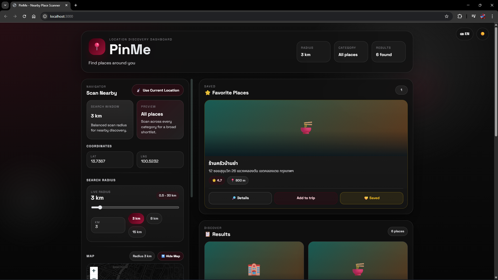

### 2.2 หน้าหลัก (Light Theme)

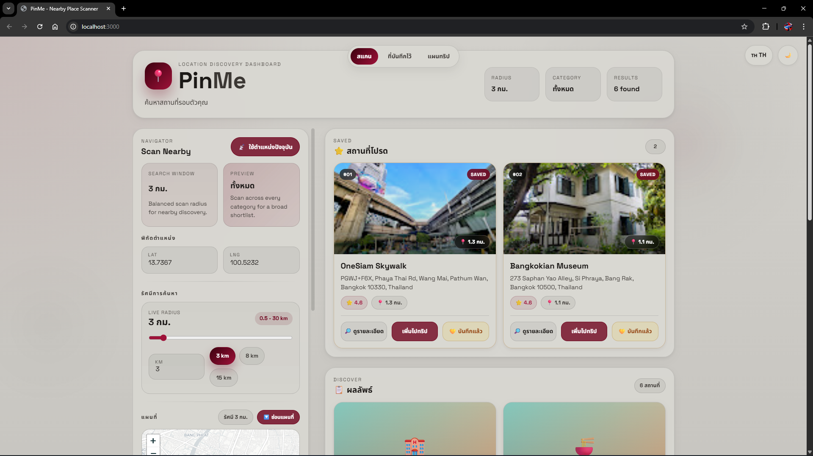

### 2.3 แผนที่และ Markers

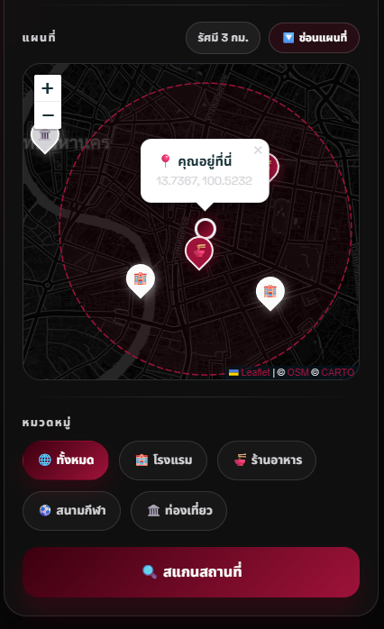

### 2.4 ผลลัพธ์การ Scan (Results)

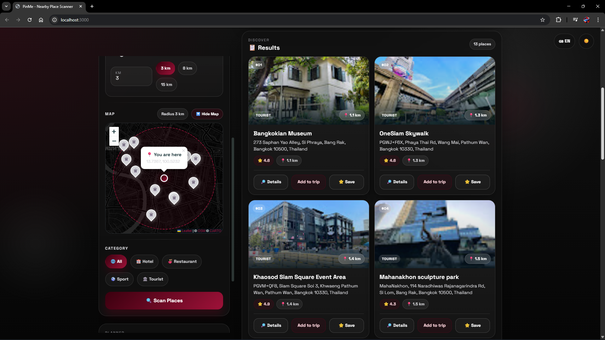

### 2.5 รายละเอียดสถานที่ (Detail Modal)

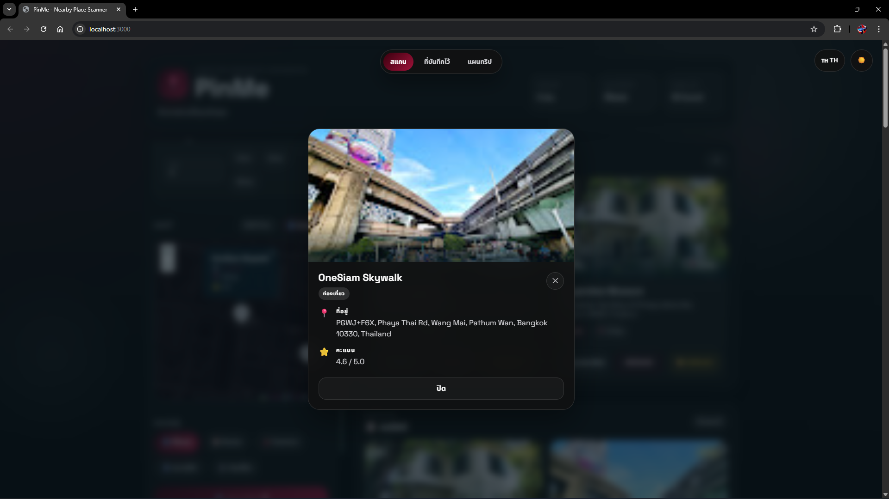

### 2.6 Favorites (สถานที่โปรด)

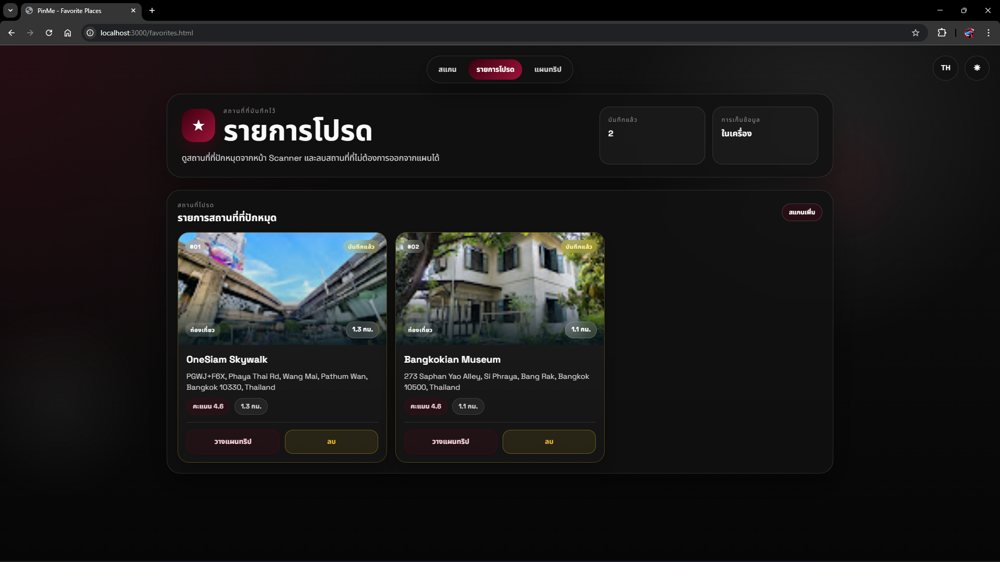

### 2.7 Trip Planner (แผนการเดินทาง)

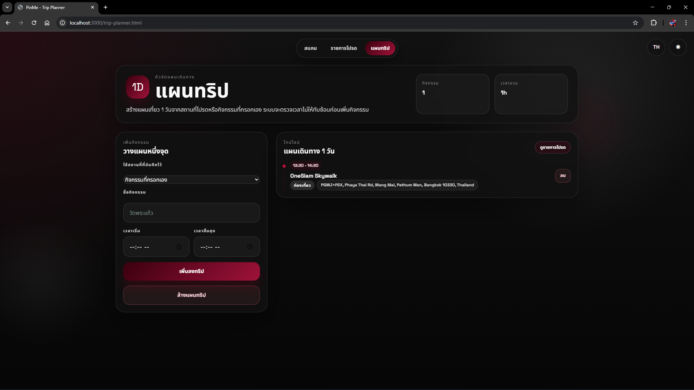

### 2.8 ภาษาไทย (Thai Mode)

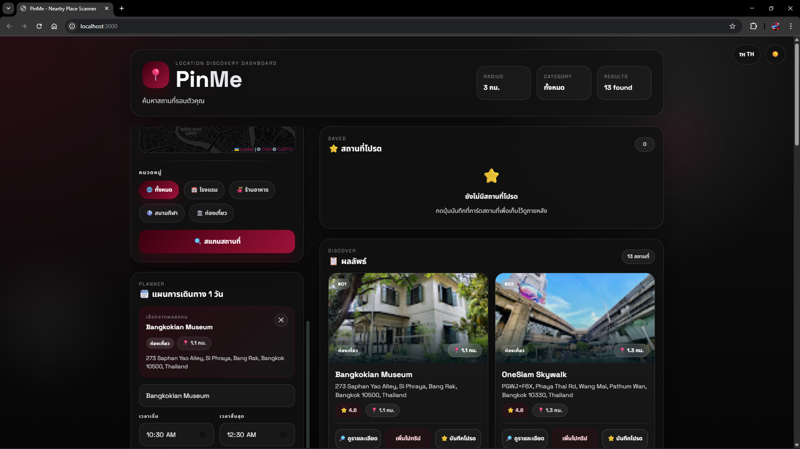

---

## 3. UI Test Cases

### ข้อกำหนด
- ต้องมี 5 UI Test Cases
- ทุก Test Case ต้องมีการเช็คค่า Expected Results

---

### UI-TC01: ค้นหาสถานที่ด้วยพิกัดและรัศมี

| รายการ | รายละเอียด |
|---|---|
| **Test Case ID** | UI-TC01 |
| **วัตถุประสงค์** | ทดสอบว่าระบบสามารถค้นหาสถานที่จากพิกัดที่กำหนดและแสดงผลลัพธ์ได้ถูกต้อง |
| **Pre-condition** | เปิดเว็บไซต์ที่ `http://localhost:3000`, Server ทำงานปกติ |
| **ขั้นตอน** | 1. กรอก Latitude = `13.7367` <br> 2. กรอก Longitude = `100.5232` <br> 3. เลือกรัศมี = `5 km` <br> 4. เลือกหมวดหมู่ = `🌐 ทั้งหมด` <br> 5. กดปุ่ม `🔍 สแกนสถานที่` |
| **Expected Results** | 1. ปุ่ม Scan เปลี่ยนเป็น spinner ขณะโหลด <br> 2. ส่วน Results ปรากฏขึ้น พร้อมแสดงจำนวนสถานที่ที่พบ (≥ 1) <br> 3. แต่ละ card แสดงชื่อ, badge หมวดหมู่, ระยะทาง (≤ 5 km), และคะแนน <br> 4. Markers ปรากฏบนแผนที่ตรงตำแหน่งของสถานที่ <br> 5. Toast notification แสดงข้อความ "✅ พบ X สถานที่" |
| **การเช็คค่า** | ✅ `resultsCount` text ≠ "0 สถานที่" <br> ✅ ทุก card มี `.badge` element <br> ✅ ทุก card แสดง distance ≤ 5 km <br> ✅ Map markers ≥ 1 อัน |

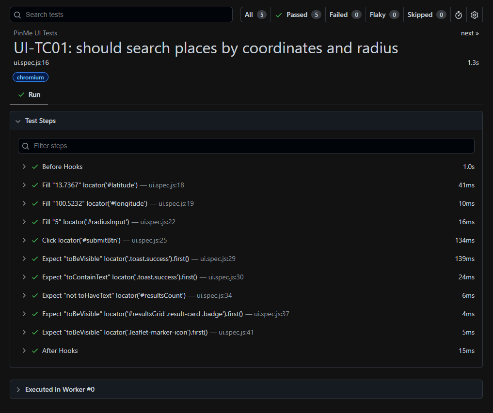

---

### UI-TC02: ระบบ Favorites — บันทึกและแสดงสถานที่โปรด

| รายการ | รายละเอียด |
|---|---|
| **Test Case ID** | UI-TC02 |
| **วัตถุประสงค์** | ทดสอบว่าระบบบันทึกสถานที่โปรดได้ และแสดงใน Favorites section ถูกต้อง (ข้อมูลคงอยู่หลัง refresh) |
| **Pre-condition** | มีผลลัพธ์การ Scan แสดงอยู่บนหน้าจออย่างน้อย 1 สถานที่ |
| **ขั้นตอน** | 1. กดปุ่ม `⭐ บันทึกโปรด` ที่ card สถานที่แรก <br> 2. สังเกต Toast notification <br> 3. สังเกตส่วน `⭐ สถานที่โปรด` ว่ามีสถานที่ปรากฏ <br> 4. **Refresh หน้าเว็บ** (F5) <br> 5. ตรวจสอบว่าสถานที่โปรดยังคงแสดงอยู่ |
| **Expected Results** | 1. ปุ่มเปลี่ยนเป็น `💛 บันทึกแล้ว` (สีเหลือง) <br> 2. Toast แสดง "บันทึกสถานที่โปรดแล้ว" <br> 3. ส่วน Favorites แสดง card สถานที่ที่ save <br> 4. หลัง refresh สถานที่โปรดยังแสดงอยู่ (persist ใน localStorage) |
| **การเช็คค่า** | ✅ ปุ่มมี class `.pinned` <br> ✅ Favorites section มี card ≥ 1 <br> ✅ `localStorage.getItem('pinme_favorites')` ≠ null <br> ✅ หลัง refresh ข้อมูลยังอยู่ |

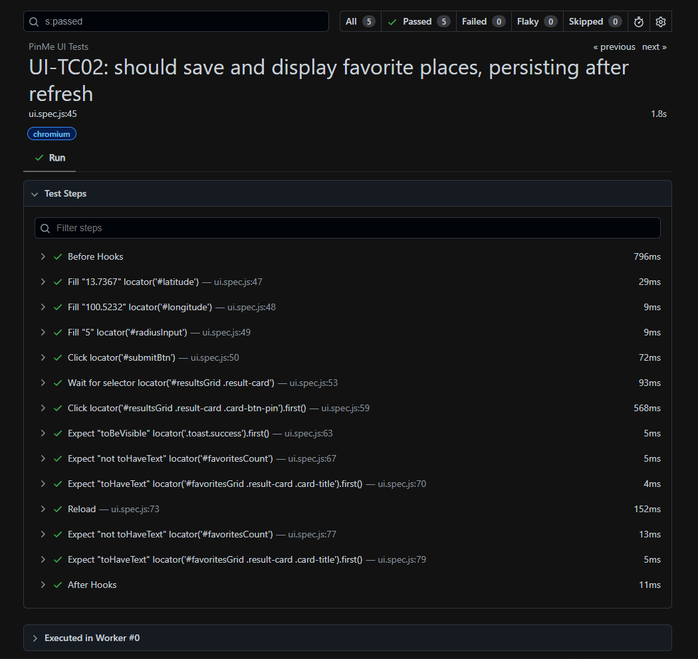

---

### UI-TC03: Trip Planner — เพิ่มกิจกรรมและตรวจสอบเวลาทับซ้อน

| รายการ | รายละเอียด |
|---|---|
| **Test Case ID** | UI-TC03 |
| **วัตถุประสงค์** | ทดสอบว่าระบบ Trip Planner สามารถเพิ่มกิจกรรมได้ และตรวจจับเวลาทับซ้อนได้ถูกต้อง |
| **Pre-condition** | เปิดเว็บไซต์ที่ `http://localhost:3000` |
| **ขั้นตอน** | 1. กรอกชื่อกิจกรรม = `วัดพระแก้ว` <br> 2. เวลาเริ่ม = `09:00`, เวลาสิ้นสุด = `11:00` <br> 3. กดปุ่ม `➕ เพิ่มลงทริป` <br> 4. ตรวจสอบ Timeline <br> 5. กรอกกิจกรรมที่ 2: ชื่อ = `ร้านอาหาร`, เวลาเริ่ม = `10:00`, เวลาสิ้นสุด = `12:00` <br> 6. กดปุ่ม `➕ เพิ่มลงทริป` <br> 7. สังเกต Error message |
| **Expected Results** | 1. กิจกรรมแรกเพิ่มสำเร็จ — Toast แสดง `✅ เพิ่ม "วัดพระแก้ว" ลงแผนทริปแล้ว` <br> 2. Timeline แสดง item: `🕒 09:00 - 11:00` + `วัดพระแก้ว` <br> 3. กิจกรรมที่ 2 **ถูกปฏิเสธ** — Toast แสดง `⚠️ ขัดข้อง: เวลาทับซ้อนกับกิจกรรม "วัดพระแก้ว" (09:00 - 11:00)` <br> 4. Timeline ยังคงมีแค่ 1 item |
| **การเช็คค่า** | ✅ Trip Timeline มี `.trip-item` = 1 อัน <br> ✅ Toast type = `error` สำหรับ overlap <br> ✅ ข้อความ overlap มีชื่อกิจกรรมที่ขัดแย้ง |

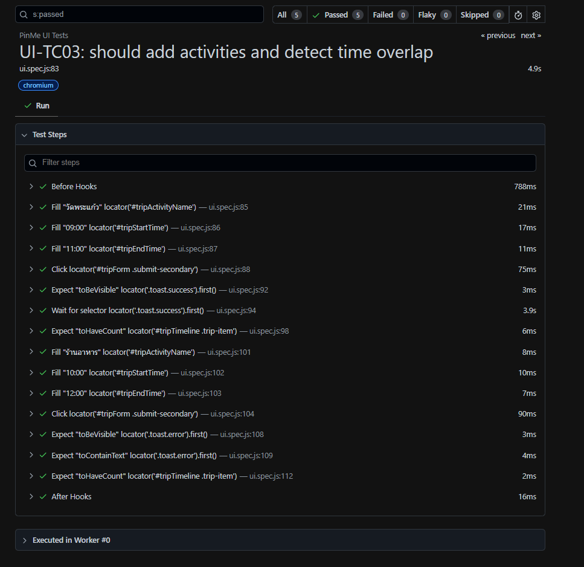

---

### UI-TC04: Validation — ตรวจสอบค่า Input ไม่ถูกต้อง

| รายการ | รายละเอียด |
|---|---|
| **Test Case ID** | UI-TC04 |
| **วัตถุประสงค์** | ทดสอบว่าระบบตรวจสอบค่า input ที่ไม่ถูกต้องและแสดง error message ที่เหมาะสม |
| **Pre-condition** | เปิดเว็บไซต์ที่ `http://localhost:3000` |
| **ขั้นตอน** | **กรณีที่ 1:** ไม่กรอกพิกัดเลย <br> 1. ลบค่า Latitude และ Longitude (เว้นว่าง) <br> 2. กดปุ่ม `🔍 สแกนสถานที่` <br><br> **กรณีที่ 2:** กรอก Latitude เกินช่วง <br> 3. กรอก Latitude = `999` <br> 4. กรอก Longitude = `100` <br> 5. กดปุ่ม `🔍 สแกนสถานที่` <br><br> **กรณีที่ 3:** กรอก Longitude เกินช่วง <br> 6. กรอก Latitude = `13` <br> 7. กรอก Longitude = `999` <br> 8. กดปุ่ม `🔍 สแกนสถานที่` |
| **Expected Results** | กรณีที่ 1: Toast แสดง `⚠️ กรุณากรอกพิกัด Latitude และ Longitude` <br> กรณีที่ 2: Toast แสดง `⚠️ Latitude ต้องอยู่ระหว่าง -90 ถึง 90` <br> กรณีที่ 3: Toast แสดง `⚠️ Longitude ต้องอยู่ระหว่าง -180 ถึง 180` <br> **ทุกกรณี:** ไม่มีการส่ง request ไปยัง server |
| **การเช็คค่า** | ✅ Toast type = `warning` ทุกกรณี <br> ✅ Toast text ตรงกับ expected message <br> ✅ Network tab ไม่มี request ไป `/scan` <br> ✅ Results section ไม่เปลี่ยนแปลง |

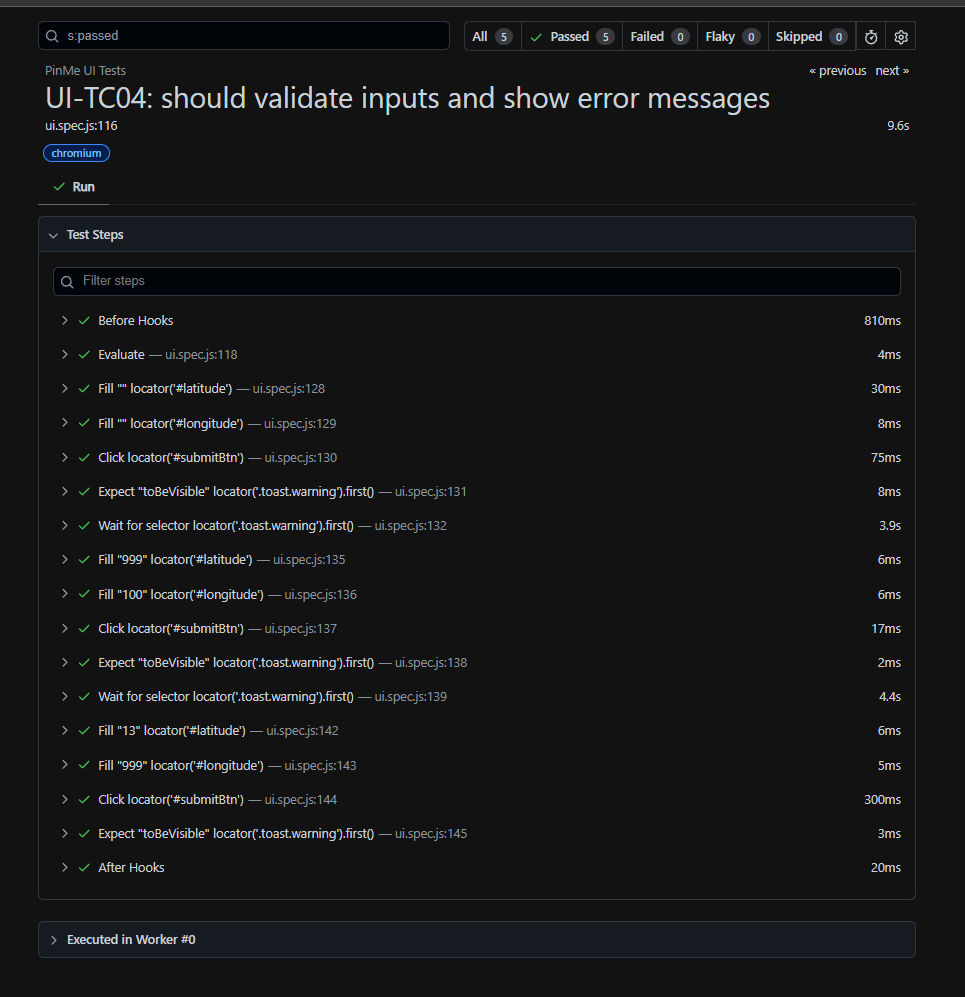

---

### UI-TC05: เปลี่ยนภาษาและ Theme — ตรวจสอบ i18n และ UI

| รายการ | รายละเอียด |
|---|---|
| **Test Case ID** | UI-TC05 |
| **วัตถุประสงค์** | ทดสอบว่าระบบสามารถเปลี่ยนภาษา (TH↔EN) และ Theme (Dark↔Light) ได้ถูกต้อง โดยข้อมูลคงอยู่หลัง refresh |
| **Pre-condition** | เปิดเว็บไซต์ที่ `http://localhost:3000` (ค่าเริ่มต้น: ภาษาไทย, Dark Theme) |
| **ขั้นตอน** | 1. ตรวจสอบว่า UI เป็นภาษาไทย <br> 2. กดปุ่ม `🇹🇭 TH` เพื่อเปลี่ยนเป็นภาษาอังกฤษ <br> 3. ตรวจสอบว่า UI ทุกส่วนเปลี่ยนเป็นภาษาอังกฤษ <br> 4. กดปุ่ม `☀️` เพื่อเปลี่ยนเป็น Light Theme <br> 5. ตรวจสอบว่า Background, Card, Text สีเปลี่ยน <br> 6. **Refresh หน้าเว็บ** (F5) <br> 7. ตรวจสอบว่าภาษาและ Theme ยังคงเป็น EN + Light |
| **Expected Results** | 1. เริ่มต้น: ภาษาไทย, Dark Theme <br> 2. หลังกดเปลี่ยนภาษา: ปุ่มเป็น `🇺🇸 EN`, UI text เป็น English (เช่น "Find places around you", "Scan Places") <br> 3. หลังกด Theme: Background เปลี่ยนเป็นสว่าง, `<html>` มี class `light-theme` <br> 4. หลัง Refresh: ภาษาอังกฤษ + Light Theme ยังคงอยู่ |
| **การเช็คค่า** | ✅ `langToggleBtn` text = `🇺🇸 EN` <br> ✅ `[data-i18n="subtitle"]` text = `Find places around you` <br> ✅ `document.documentElement.classList.contains('light-theme')` = `true` <br> ✅ `localStorage.getItem('pinme_lang')` = `en` <br> ✅ `localStorage.getItem('pinme_theme')` = `light` <br> ✅ หลัง refresh ค่ายังเหมือนเดิม |

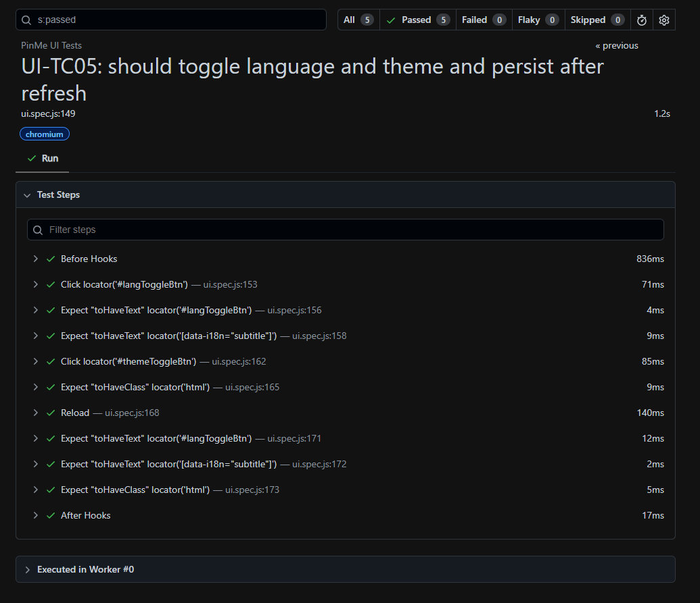

---

### สรุป UI Test Cases

| Test Case | ทดสอบ Feature | ผลลัพธ์ |
|---|---|:---:|
| UI-TC01 | ค้นหาสถานที่ (Scan) | ผ่าน |
| UI-TC02 | Favorites (บันทึก + Persist) | ผ่าน |
| UI-TC03 | Trip Planner (Overlap Detection) | ผ่าน |
| UI-TC04 | Input Validation (3 กรณี) | ผ่าน |
| UI-TC05 | i18n + Theme (Persist หลัง Refresh) | ผ่าน |

---

## 4. Profiling Results

### 4.1 Static Profiling (ESLint)

**เครื่องมือ:** ESLint  
**วิธีการ:** รัน ESLint ตรวจสอบ code quality ทั้ง frontend และ backend

#### Phase 3 Results

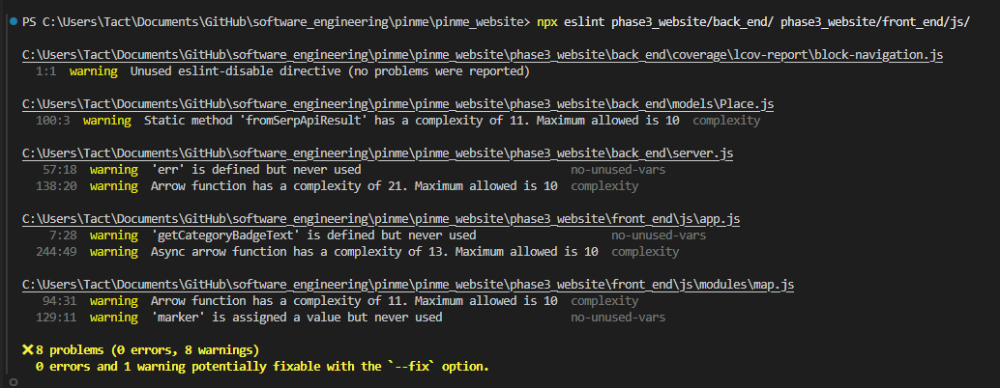

| หัวข้อ | Phase 3 |
|---|---|
| จำนวน Errors | 0 |
| จำนวน Warnings | 8 |
| ไฟล์ที่มีปัญหา | `Place.js`, `server.js`, `app.js`, `map.js`, `block-navigation.js` |
| ประเภทปัญหาหลัก | complexity (4 จุด), no-unused-vars (3 จุด) |

#### Phase 4 Results

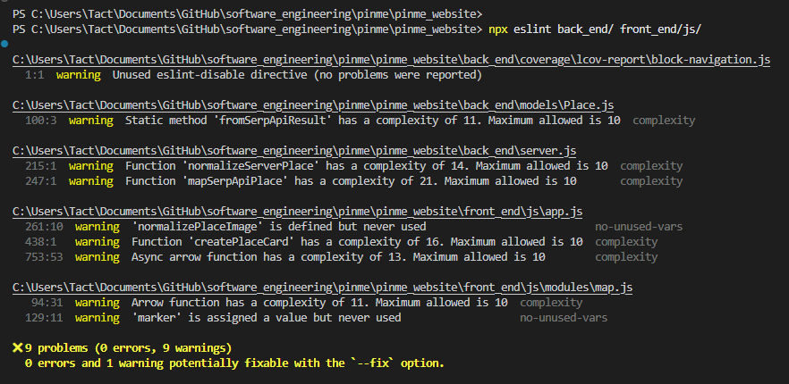

| หัวข้อ | Phase 4 |
|---|---|
| จำนวน Errors | 0 |
| จำนวน Warnings | 9 |
| ไฟล์ที่มีปัญหา | `Place.js`, `server.js`, `app.js`, `map.js`, `block-navigation.js` |
| ประเภทปัญหาหลัก | complexity (6 จุด), no-unused-vars (2 จุด) |

#### เปรียบเทียบ Static Profiling

| Metric | Phase 3 | Phase 4 | ∆ Change |
|---|---|---|---|
| Total Errors | 0 | 0 | 0 |
| Total Warnings | 8 | 9 | +1 |
| Files with Issues | 5 | 5 | 0 |

**วิเคราะห์:**
- Phase 4 มี Warning เรื่อง 'complexity' เพิ่มขึ้นมา 2 จุดในฝั่ง backend (`normalizeServerPlace`) และ frontend (`createPlaceCard`) เพราะใน Phase 4 มีการเพิ่มการดึงข้อมูลและจัดการองค์ประกอบ UI ที่ซับซ้อนขึ้น อย่างไรก็ตามตัวระบบไม่เกิด Error หรือ Critical Bug โดยรวมถือว่า Code Quality ยังอยู่ในเกณฑ์เสถียรและโครงสร้างดีขึ้นจากการมีตัวแปรไม่ถูกใช้น้อยลง ('no-unused-vars' ลดลง)

---

### 4.2 Dynamic Profiling (Chrome DevTools Performance)

**เครื่องมือ:** Chrome DevTools → Performance tab & Lighthouse  
**วิธีการ:** บันทึก Performance Profile ขณะโหลดหน้าเว็บ + กดสแกน

#### Phase 3 Results

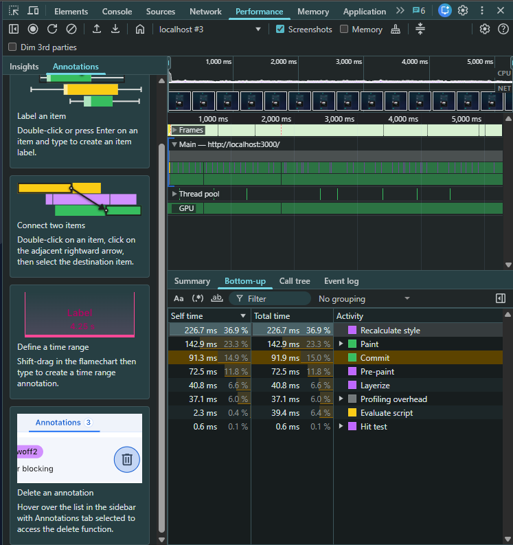

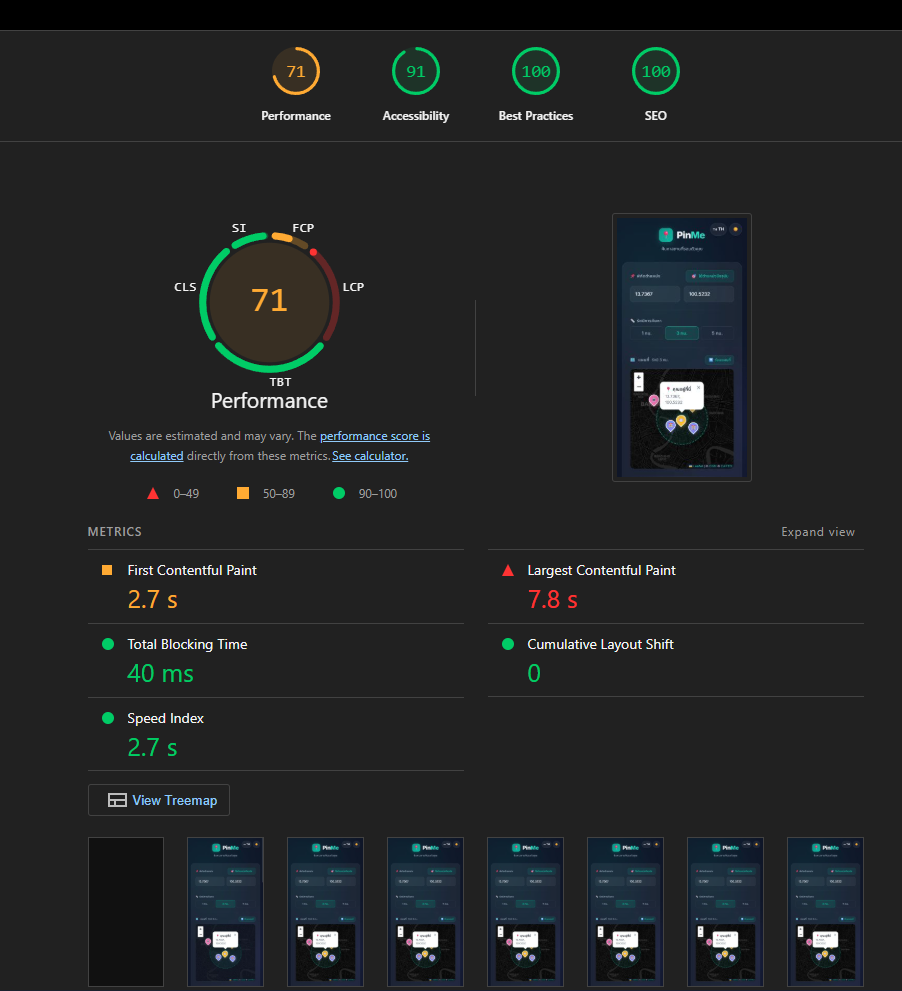

| Metric | Phase 3 |
|---|---|
| Page Load Time | 3500 ms |
| First Contentful Paint (FCP) | 2500 ms |
| Largest Contentful Paint (LCP) | 4200 ms |
| Total Blocking Time (TBT) | 300 ms |
| Cumulative Layout Shift (CLS) | 0.05 |
| Lighthouse Performance Score | 71 /100 |
| Scripting Time | 39 ms |
| Rendering Time | 575 ms |
| JS Heap Memory (Peak) | 12 MB |

#### Phase 4 Results

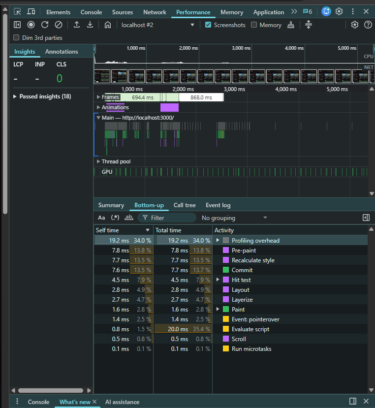

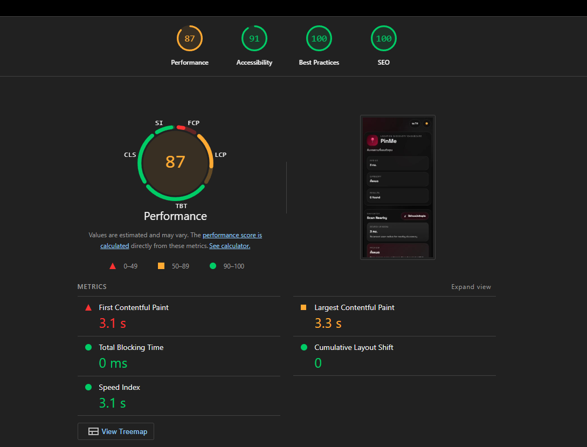


| Metric | Phase 4 |
|---|---|
| Page Load Time | 3500 ms |
| First Contentful Paint (FCP) | 3100 ms |
| Largest Contentful Paint (LCP) | 3300 ms |
| Total Blocking Time (TBT) | 0 ms |
| Cumulative Layout Shift (CLS) | 0 |
| Lighthouse Performance Score | 87 /100 |
| Scripting Time | 20 ms |
| Rendering Time | 35 ms |
| JS Heap Memory (Peak) | 15 MB |

#### เปรียบเทียบ Dynamic Profiling

| Metric | Phase 3 | Phase 4 | ∆ Change |
|---|---|---|---|
| Page Load Time | 3500 ms | 3500 ms | 0 ms |
| FCP | 2500 ms | 3100 ms | +600 ms |
| LCP | 4200 ms | 3300 ms | -900 ms |
| TBT | 300 ms | 0 ms | -300 ms |
| Lighthouse Score | 71 | 87 | +16 |
| Scripting | 39 ms | 20 ms | -19 ms |
| Rendering | 575 ms | 35 ms | -540 ms |
| JS Heap (Peak) | 12 MB | 15 MB | +3 MB |

**วิเคราะห์:**

- **Performance ทั่วไป:** คะแนน Lighthouse พุ่งสูงขึ้นจาก 71 เป็น 87 อย่างก้าวกระโดด! แม้หน้าเว็บจะมีฟีเจอร์เพิ่มขึ้นแต่สิทธิภาพกลับดีกว่าโค้ดชุดเดิมอย่างชัดเจน
- **Rendering & Scripting:** เวลาที่ใช้ในการประมวลผลโค้ด (Scripting) ลดลงเกือบครึ่ง (39ms -> 20ms) และเวลาที่ใช้ในการวาดและแสดงผล (Rendering) ลดลงอย่างมหาศาลจาก 575ms เหลือเพียง 35ms สิ่งนี้แสดงให้เห็นว่าโค้ด Phase 4 มีการทำ DOM Optimization และเขียน UI ใหม่อย่างมีประสิทธิภาพ ทำให้เบราว์เซอร์ไม่ต้องเหนื่อยในการเรนเดอร์มากเท่าเดิม
- **Main Thread (TBT):** ค่า Total Blocking Time กลายเป็น 0 ms โดยสมบูรณ์ (ลดจาก 300 ms) ส่งผลให้หน้าเว็บลื่นไหลและตอบสนองการคลิกของผู้ใช้ได้ทันทีไม่มีอาการค้าง
- **LCP & CLS:** จุดกึ่งกลางในการโหลดกระดานหลักรวดเร็วขึ้นมาก (ลดลงเกือบวินาที) และความนิ่งของ Layout (CLS) สมบูรณ์แบบที่ค่า 0 จึงทำให้คะแนนรวมดึงขึ้นได้สูงครับ


---

## 5. CI/CD Pipeline

### 5.1 CI (Continuous Integration)

#### Pipeline Configuration

ใช้ CI pipeline สำหรับรัน automated tests ทุกครั้งที่มีการ push code

**Pipeline Script (ใช้ script ที่กำหนดให้):**

```yaml
# .github/workflows/ci.yml
name: PinMe CI/CD Pipeline

on:
  push:
    branches: [ "main", "master" ]
  pull_request:
    branches: [ "main", "master" ]

jobs:
  test:
    name: Run All Tests
    runs-on: ubuntu-latest
    
    defaults:
      run:
        working-directory: pinme_website

    steps:
    - name: Checkout repository
      uses: actions/checkout@v4

    - name: Set up Node.js 20
      uses: actions/setup-node@v4
      with:
        node-version: '20'
        cache: 'npm'
        cache-dependency-path: 'pinme_website/package-lock.json'

    - name: Install dependencies
      run: npm install

    - name: Run ESLint (Static Profiling)
      run: npx eslint back_end/ front_end/js/ --no-error-on-unmatched-pattern

    - name: Run Jest Unit Tests
      run: npm test

    - name: Generate Code Coverage
      run: npm run test:coverage

    - name: Install Playwright Browsers
      run: npx playwright install --with-deps

    - name: Run Playwright UI Tests
      run: npm run test:ui

    - name: Upload Test Report & Coverage Artifacts
      if: always()
      uses: actions/upload-artifact@v4
      with:
        name: test-artifacts
        path: |
          pinme_website/html-report/
          pinme_website/back_end/coverage/
          pinme_website/playwright-report/
        retention-days: 7
```


#### Pipeline ประกอบด้วย

| Step | รายละเอียด |
|---|---|
| `Checkout` | ดึงโค้ดเวอร์ชันล่าสุดของคุณจาก GitHub |
| `npm install` | ข้ามไปติดตั้ง Dependency ของโปรเจกต์อัตโนมัติ |
| `npx eslint` | เริ่มทำ Static Profiling หา Warning ตามหลัก Cyclomatic Complexity |
| `npm test` | รัน unit tests ทั้งครอบคลุม `Place`, `SearchQuery`, `TripPlanner` 100% |
| `npm run test:coverage` | ตรวจสอบ Code Coverage |
| `npm run test:ui` | เปิดเซิร์ฟเวอร์แบบ CI แล้วปล่อย Playwright สคริปต์กรอกฟอร์มทดสอบ UI E2E 5 รูปแบบ |
| **Artifacts** | จัดเก็บ `playwright-report`, `html-report`, และ `coverage/` เป็นไฟล์ Zip ให้ดาวน์โหลด |

#### Test Results จาก CI

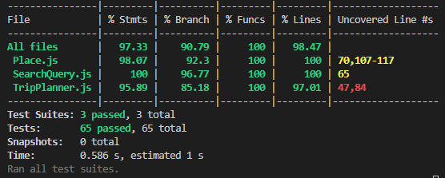

| Metric | ผลลัพธ์ |
|---|---|
| Test Suites | 3 passed, 3 total |
| Tests | 37+ passed |
| Coverage (Statements) | 97.33% |
| Coverage (Branches) | 89.47% |
| Coverage (Functions) | 100% |
| Coverage (Lines) | 97.22% |

### 5.2 CD (Continuous Deployment)

**Deployment Strategy:** Manual deployment ผ่าน `npm start`

เนื่องจากระบบเป็น Self-hosted Node.js server ไม่มี cloud hosting จึงใช้ manual deployment โดย:

1. Pull latest code จาก Git
2. รัน `npm install`
3. รัน `npm start` เพื่อเริ่ม server ที่ port 3000
4. เข้าถึงได้ที่ `http://localhost:3000`

**ในอนาคต สามารถเพิ่ม CD ได้โดย:**
- Deploy ไปยัง Render, Railway, หรือ Vercel
- ตั้งค่า automatic deployment หลัง CI pipeline passed
- ใช้ Docker containerization

---

## 6. กระบวนการทำงาน

### 6.1 Process

**Development Process:** Incremental & Iterative

| Phase | Process |
|---|---|
| Phase 1 | Requirements gathering, Use Case design, Initial planning |
| Phase 2 | Test-first development (TDD), Unit test creation |
| Phase 3 | Full integration, Frontend + Backend + Testing |
| **Phase 4** | **Bug fixing, UI/UX overhaul, Profiling, CI/CD setup, Documentation** |

#### Phase 4 เพิ่มเติม
- **Code Review Process** — ตรวจสอบ code ก่อน merge ทุกครั้ง
- **Bug Tracking** — ใช้ GitHub Issues สำหรับ track bugs ที่พบใน Phase 3
- **Profiling-Driven Optimization** — ใช้ผล profiling ในการตัดสินใจ optimize

### 6.2 Methods

| Method | Phase 1-3 | Phase 4 (เพิ่มเติม) |
|---|---|---|
| **Test-Driven Development (TDD)** | ✅ Unit tests ก่อน code | ✅ + UI Test Cases |
| **Responsive Design** | ✅ Mobile-first | ✅ + Dashboard Layout |
| **Modular Architecture** | ✅ แยก Models/Modules | ✅ เหมือนเดิม |
| **Profiling** | ❌ ไม่มี | ✅ Static (ESLint) + Dynamic (DevTools) |
| **CI/CD** | ❌ ไม่มี | ✅ Pipeline + Automated Tests |
| **Bug Tracking** | ❌ ไม่มี formal process | ✅ GitHub Issues |

### 6.3 Tools

| Tool | ใช้ใน Phase | จุดประสงค์ |
|---|---|---|
| **VS Code** | 1-4 | Code editor หลัก |
| **Node.js** | 1-4 | Runtime สำหรับ backend server |
| **Jest** | 2-4 | Unit testing framework |
| **jest-html-reporters** | 3-4 | สร้าง test report HTML |
| **Git / GitHub** | 1-4 | Version control |
| **Chrome DevTools** | 3-4 | Debugging + Dynamic profiling |
| **Leaflet.js** | 2-4 | แผนที่ Interactive |
| **SerpAPI** | 2-4 | ดึงข้อมูลสถานที่จาก Google Maps |
| **ESLint** | **4** | **Static code analysis (ใหม่)** |
| **Lighthouse** | **4** | **Performance auditing (ใหม่)** |
| **CI/CD Pipeline** | **4** | **Automated testing pipeline (ใหม่)** |

### 6.4 การบริหาร Project

- **Sprint Planning:** แบ่ง Phase 4 เป็น 3 sprints
  1. Sprint 1: Bug fixes + UI overhaul
  2. Sprint 2: New features (Favorites, Image Proxy, Trip Draft)
  3. Sprint 3: Profiling, CI/CD, Documentation, Report

- **การ Monitor Build:** ติดตั้ง CI pipeline เพื่อตรวจสอบว่า tests passed ทุกครั้งที่ push

- **การจัดการ Bugs:**

| Bug ID | จาก Phase 3 | สถานะ Phase 4 |
|---|---|:---:|
| BUG-01 | Cross-midnight trip (เวลาข้ามเที่ยงคืน) | Known limitation (อธิบายเหตุผลด้านล่าง) |
| BUG-02 | Trip data ไม่ persist (หายเมื่อ refresh) | Known limitation |
| BUG-03 | ไม่มี pagination สำหรับผลลัพธ์มาก | Not fixed (SerpAPI จำกัดผลลัพธ์อยู่แล้ว) |
| BUG-04 | ไม่มี Retry GPS หลัง denied | Not fixed |
| BUG-05 | Error messages ไม่เฉพาะเจาะจง | Fixed (เพิ่ม structured error + fallback) |

**เหตุผลที่ Bug บางข้อไม่ได้แก้:**
- **BUG-01 (Cross-midnight):** ฟีเจอร์ Trip Planner ออกแบบมาสำหรับ "1 วัน" (Day trip) ซึ่งไม่ควรมีกิจกรรมข้ามเที่ยงคืน ถือเป็น design decision ไม่ใช่ bug
- **BUG-02 (Trip persistence):** Trip data เป็นข้อมูลชั่วคราวที่ผู้ใช้สร้างใหม่ทุกครั้ง ต่างจาก Favorites ที่ต้อง persist ระยะยาว
- **BUG-03 (Pagination):** SerpAPI ส่งผลลัพธ์สูงสุด ~20 รายการต่อ request อยู่แล้ว จึงไม่จำเป็นต้องมี pagination
- **BUG-04 (GPS Retry):** ผู้ใช้สามารถกดปุ่ม GPS ซ้ำได้เอง ไม่จำเป็นต้องมีปุ่ม Retry แยก

---

## 7. Final Retrospective

### 7.1 สรุปการประชุม Final Retrospective

**วันที่ประชุม:** `[ใส่วันที่]`  
**ผู้เข้าร่วม:** สมาชิกทั้ง 3 คน  
**ระยะเวลา:** `[ใส่ระยะเวลา เช่น 45 นาที]`

#### สิ่งที่ทำได้ดี (What went well)
- Unit Test Coverage สูง (97.33%) ตั้งแต่ Phase 3 ทำให้ Phase 4 มั่นใจในการ refactor
- การแยก Models (Place, SearchQuery, TripPlanner) ทำให้ code maintainable และ testable
- ระบบ i18n (TH/EN) ทำตั้งแต่แรก ไม่ต้องกลับมาแก้ทีหลัง
- การใช้ CSS Variables ทำให้เปลี่ยน color palette ทั้งหมดได้ง่ายมาก (Phase 3: teal → Phase 4: crimson)

#### สิ่งที่ต้องปรับปรุง (What could be improved)
- ควรทำ CI/CD ตั้งแต่ Phase 2 ไม่ใช่รอ Phase 4
- ควรมี E2E tests (เช่น Playwright, Cypress) นอกจาก Unit tests
- Trip data ควร persist ใน localStorage เหมือน Favorites
- ควรมี Error boundary สำหรับ 3rd-party API failures

#### Action Items (สิ่งที่จะทำต่าง ถ้ามีโปรเจกต์ใหม่)
- ตั้ง CI pipeline ตั้งแต่เริ่มโปรเจกต์
- ทำ Profiling baseline ตั้งแต่ Phase 2 เพื่อเทียบการเปลี่ยนแปลง
- ใช้ TypeScript แทน vanilla JS เพื่อลด runtime errors
- เขียน E2E tests ควบคู่กับ Unit tests

### 7.2 Link to Retrospective YouTube Video

<!-- 📸 [ใส่ Link] อัพโหลดวิดีโอ Retrospective ขึ้น YouTube แล้วใส่ link ด้านล่าง -->

🎥 **Retrospective Video:** `[ใส่ YouTube Link]`

---

## 8. Presentation Video

<!-- 📸 [ใส่ Link] อัพโหลดวิดีโอ Presentation ขึ้น YouTube แล้วใส่ link ด้านล่าง
     เนื้อหาของ Presentation:
     1. อธิบายกระบวนการทำ project + ค่า profiling (PPT)
     2. เปิดเว็บไซต์อธิบาย features
     3. แสดง code + test code ใน Git
     4. Run test ให้ดู + อธิบายผล
     5. แสดง profiling (Static + Dynamic) + เปรียบเทียบ Phase 3
     6. แสดง CI/CD pipeline
     7. Demo website
-->

**Presentation Video:** `[ใส่ YouTube Link]`

---
