# สมาชิกกลุ่ม

นายบุญยศักดิ์ รัตนดิลก ณ ภูเก็ต 67102010165

อนันฌานนทน์ แป้นสุวรรณ 67102010176

นายสิทธิโชติ เกรียงชัยพฤกษ์ 67102010224

# pinme

## **1) ที่มาของปัญหาและความสำคัญ**

ในชีวิตประจำวัน ผู้ใช้มักต้องการค้นหาสถานที่ใกล้ตัวภายในระยะที่กำหนด เช่น ร้านอาหาร โรงแรม สนามกีฬา หรือสถานที่ท่องเที่ยว แต่การค้นหาผ่านหลายแพลตฟอร์มทำให้ข้อมูลกระจัดกระจาย ใช้เวลาในการเปรียบเทียบ และไม่สะดวกในการจัดหมวดหมู่เพื่อเลือกสถานที่ที่เหมาะสม

นอกจากนี้ เมื่อผู้ใช้ต้องการไปหลายสถานที่ในวันเดียว ยังขาดเครื่องมือที่ช่วย **จัดแผนแบบเป็นระบบ** เช่น การเรียงลำดับกิจกรรมและกำหนดช่วงเวลา ซึ่งทำให้แผนเดินทางสับสนและเกิดเวลาทับซ้อนกันได้ง่าย

ดังนั้น โครงงานนี้จึงมีความสำคัญในการพัฒนาระบบที่ช่วยให้ผู้ใช้สามารถ **สแกนสถานที่ใกล้เคียงตามรัศมี**, **จัดหมวดหมู่**, และ **วางแผนทริป 1 วัน** ได้อย่างเป็นระบบในแพลตฟอร์มเดียว

---

## **2) จุดประสงค์ของโครงงาน และประโยชน์ที่คาดว่าจะได้รับ**

### **จุดประสงค์ของโครงงาน (แก้ปัญหาอะไร)**
- พัฒนาระบบสำหรับค้นหาสถานที่ใกล้เคียงจากจุดตั้งต้นและระยะทางที่กำหนด พร้อมแยกหมวดหมู่สถานที่  
- เพิ่มฟังก์ชันการกรองและเรียงลำดับเพื่อช่วยให้ผู้ใช้ตัดสินใจได้เร็วขึ้น  
- พัฒนา **Mini Trip Planner (1 วัน)** เพื่อช่วยผู้ใช้เลือกหลายสถานที่และกำหนดช่วงเวลา โดยระบบตรวจสอบการทับซ้อนของเวลา  
- ฝึกกระบวนการพัฒนาซอฟต์แวร์ตามหลัก **Software Engineering (SDLC)** รวมถึงการออกแบบ การทดสอบ การวัดผล และการบริหารโครงงาน  

### **ประโยชน์ที่คาดว่าจะได้รับ**
- ผู้ใช้ค้นหาสถานที่ในรัศมีที่ต้องการได้รวดเร็วและเป็นหมวดหมู่  
- ลดเวลาการหาข้อมูลและการจัดแผนเดินทาง  
- ผู้ใช้สามารถวางแผนทริป 1 วันได้ชัดเจน ลดปัญหาเวลาทับซ้อน  
- ทีมพัฒนาได้ฝึกการทำงานแบบเป็นระบบ ใช้เครื่องมือ DevOps และสร้างเอกสารตามมาตรฐาน  

---

## **3) ขอบเขตของโครงงาน (Scope)**

### **สิ่งที่ทำ (In Scope)**
- ผู้ใช้เลือกจุดตั้งต้น (สถานที่/พิกัด) และกำหนดรัศมีค้นหา (กิโลเมตร)  
- ระบบสแกนและแสดงรายการสถานที่ใกล้เคียงภายในรัศมีที่กำหนด  
- แยกหมวดหมู่สถานที่: โรงแรม / ร้านอาหาร / สนามกีฬา / สถานที่ท่องเที่ยว  
- กรองและเรียงผลลัพธ์ (เช่น เรียงตามระยะใกล้สุด)  
- แสดงหน้ารายละเอียดสถานที่ (ชื่อ หมวดหมู่ ระยะทาง และปุ่มเปิดแผนที่)  
- ผู้ใช้สามารถบันทึกสถานที่ที่สนใจ (Bookmark)  
- **Mini Trip Planner (1 วัน):** เลือกหลายสถานที่ กำหนดเวลา แสดงเป็น timeline/ปฏิทิน และตรวจสอบเวลาทับซ้อน  

### **สิ่งที่ไม่ทำ (Out of Scope)**
- ไม่ทำการคำนวณเส้นทางที่ดีที่สุด (Route Optimization)  
- ไม่ทำระบบจองหรือชำระเงินจริง  
- ไม่ทำระบบรีวิวขั้นสูงหรือโซเชียลฟีด  
- ไม่ใช้ AI เพื่อแนะนำสถานที่ (ใช้การกรองและจัดหมวดหมู่ตามกฎ)  

---

## **4) Functional & Non-Functional Requirements**

### **4.1 Functional Requirements (FR)**
- **FR-01** ผู้ใช้สามารถเลือกจุดตั้งต้นและกำหนดรัศมีค้นหาได้  
- **FR-02** ระบบสามารถค้นหาและแสดงสถานที่ภายในรัศมีที่กำหนดได้  
- **FR-03** ระบบสามารถแยกผลลัพธ์ตามหมวดหมู่ (โรงแรม/ร้านอาหาร/สนามกีฬา/ท่องเที่ยว) ได้  
- **FR-04** ผู้ใช้สามารถกรองและเรียงผลลัพธ์ตามระยะทางได้  
- **FR-05** ผู้ใช้สามารถดูรายละเอียดสถานที่และเปิดดูตำแหน่งบนแผนที่ได้  
- **FR-06** ผู้ใช้สามารถบันทึก (Bookmark) และยกเลิก Bookmark ได้  
- **FR-07** ผู้ใช้สามารถสร้างทริป 1 วัน โดยเลือกหลายสถานที่ได้  
- **FR-08** ผู้ใช้สามารถกำหนดเวลาเริ่มต้น–สิ้นสุดของแต่ละสถานที่ในทริปได้  
- **FR-09** ระบบต้องตรวจสอบและแจ้งเตือนเมื่อเวลาของกิจกรรมในทริปทับซ้อนกัน  
- **FR-10** ระบบสามารถแสดงทริปเป็น timeline หรือปฏิทินรายวันได้  

### **4.2 Non-Functional Requirements (NFR)**
- **NFR-01 Usability:** ผู้ใช้สามารถสแกนสถานที่ได้ภายในไม่เกิน 3–4 ขั้นตอน  
- **NFR-02 Performance:** แสดงผลการสแกนภายใน 2 วินาที เมื่อจำนวนข้อมูลอยู่ในขอบเขตที่กำหนด  
- **NFR-03 Accuracy:** การคำนวณระยะทางต้องถูกต้องตามสูตรที่ใช้ (เช่น Haversine Formula)  
- **NFR-04 Reliability:** ผลลัพธ์ต้องสม่ำเสมอเมื่อใช้ input เดิม และการตรวจสอบเวลาทับซ้อนต้องเชื่อถือได้  
- **NFR-05 Maintainability:** โครงสร้างระบบแยกโมดูล (Scan / Filter / Trip / Bookmark) เพื่อให้แก้ไขและต่อยอดได้ง่าย  
- **NFR-06 Compatibility:** ระบบสามารถใช้งานผ่านเว็บเบราว์เซอร์ทั่วไปได้  

## 5) กระบวนการทำงาน (Process, Methods, and Tools)
Process (แนวทางพัฒนา)

ใช้กระบวนการพัฒนาแบบ Incremental + Iterative แบ่งงานเป็นรอบ (Sprint/Phase)

Phase 1: เก็บ requirement, user stories, scope, FR/NFR

Phase 2: ออกแบบระบบ (Architecture + Use Case) ออกแบบ UI ด้วย Figma และสร้างเว็บอย่างน้อย 2 หน้า พร้อม endpoint ประมวลผล input

Phase 3: พัฒนาเว็บเกือบสมบูรณ์ เพิ่ม unit tests ให้ครอบคลุม data structure 100% และเก็บค่า profiling baseline

Phase 4: พัฒนาเว็บสมบูรณ์ เพิ่ม UI tests, ทำ CI/CD และเปรียบเทียบผล profiling กับ Phase 3

### Methods (วิธีทำงาน)

Requirement elicitation & refinement

User stories และ acceptance criteria

Sprint planning และการติดตามงาน

Retrospective เพื่อปรับปรุงการทำงานในแต่ละ phase

### Tools (เครื่องมือที่ใช้)

Azure DevOps Boards: จัดการ Product และ Sprint Backlog

Azure Repos (Git): Version control, branch และ pull request

Figma: ออกแบบ UI และใช้ screenshot ประกอบรายงาน

Mermaid: สร้าง Use Case และ Architecture Diagram

Testing tools: เช่น Jest/Supertest สำหรับ unit test และ coverage

Profiling tools: เก็บข้อมูล static และ dynamic profiling

CI/CD Pipeline: ใช้ pipeline script ที่อาจารย์กำหนด

Communication: LINE/Discord, Zoom/Teams และ YouTube สำหรับ retrospective
---

## **6) Use Case Diagram**

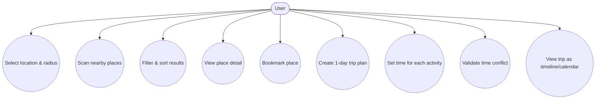

## 7) process, methods, and tools 

1) Process (กระบวนการทำงาน)
  
ทีมงานใช้การพัฒนาแบบ Incremental + Iterative คือทำงานทีละส่วน และปรับปรุงแก้ไขไปเรื่อย ๆ โดยมีขั้นตอนหลักดังนี้
- Phase 1: เก็บและวิเคราะห์ Requirement ของระบบ กำหนดขอบเขตโครงงาน และสรุปฟังก์ชันที่ต้องทำ
- Phase 2: ออกแบบระบบและหน้าจอการใช้งาน โดยใช้ Figma ช่วยออกแบบ UI และสร้าง Website เบื้องต้น
- Phase 3: พัฒนา Website ให้เกือบสมบูรณ์ เพิ่มการทดสอบระบบ และตรวจสอบประสิทธิภาพของโปรแกรม
- Phase 4: ปรับปรุง Website ให้สมบูรณ์ เพิ่มการทดสอบเพิ่มเติม และทำระบบ CI/CD
- การทำงานเป็นรอบ ๆ ช่วยให้สามารถตรวจสอบงานและแก้ไขปัญหาได้ตลอดการพัฒนา

2) Methods (วิธีการทำงาน)

ในการทำงาน ทีมใช้วิธีการดังนี้
- พูดคุยและสรุป requirement ร่วมกัน
- แบ่งงานตามความถนัดของสมาชิกในทีม
- วางแผนงานในแต่ละช่วง และติดตามความคืบหน้า
- ประชุมสรุปผลและทำ Retrospective หลังจบแต่ละ Phase
- จากการทำ Retrospective พบว่าช่วงแรกทีมมีความเข้าใจในขอบเขตโครงงานไม่ตรงกัน จึงแก้ไขโดยการสร้าง Prototype เพื่อช่วยให้เห็นภาพระบบชัดเจนมากขึ้น และทำให้ทุกคนเข้าใจตรงกัน

3) Tools (เครื่องมือที่ใช้)

ทีมงานใช้เครื่องมือต่าง ๆ เพื่อช่วยในการพัฒนาโครงงาน ได้แก่
- Azure DevOps Boards สำหรับจัดการงานและติดตามความคืบหน้า
- Azure Repos (Git) สำหรับเก็บและจัดการซอร์สโค้ด
- Figma สำหรับออกแบบหน้าจอการใช้งาน
- Mermaid สำหรับสร้างแผนภาพ Use Case
- เครื่องมือทดสอบ สำหรับตรวจสอบความถูกต้องของระบบ
- LINE / Discord / Zoom สำหรับการสื่อสารและประชุมทีม

## 8) Summary Requirement

[Requirement Video](https://youtu.be/yf1TyKvzm6Q)

-  หลังจากที่ได้อธิบายรายละเอียดของโปรเจกต์ให้กับกลุ่มอื่นรับฟัง ก็ได้รับผลตอบรับที่ดี และในส่วนของ requirement ก็ไม่มีประเด็นปัญหาที่ต้องแก้ไขมากนัก

ส่วนของ requirement 
1) เลือกจุดตั้งต้น
2) กำหนดระยะทาง
3) ค้นหาสถานที่ใกล้เคียง
4) แยกหมวดหมู่สถานที่
5) กรองและเรียงลำดับผลลัพธ์
6) แสดงรายละเอียดสถานที่
7) บันทึกสถานที่ที่สนใจ
8) สร้างแผนการเดินทาง 1 วัน
9) กำหนดช่วงเวลาในแผนการเดินทาง
10) ตรวจสอบความซ้ำซ้อนของเวลา
  
## 9) Summary Retrospective

[Retrospective Video](https://youtu.be/FMwXFTwsZNE)

-  ปัญหาเริ่มมาจากการมองภาพของ Project นี้และ Scope ไม่ตรงกัน ทำให้เกิดปัญหาความขัดแย้ง ดังนั้นจึงแก้ปัญหาด้วยการสร้าง Prototype เพื่อปรับความเข้าใจกันทำให้มุมมองตรงกันและช่วยกันแก้ไขจนได้ Version ในปัจจุบัน และอีกปัญหาคือการไม่คุ้นชินกับเครื่องมือที่ใช้เกี่ยวกับการทำงาน

## 10) Product backlog

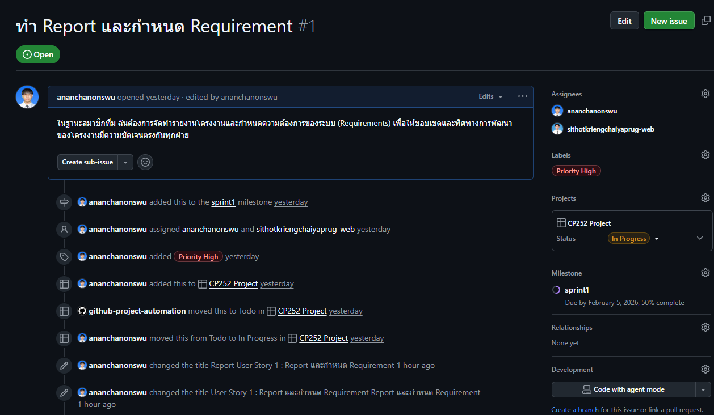

---

## 11) Sprint backlog

---

### sprint 1 (Due Feb 5th)

เป้าหมาย

- เพื่อวิเคราะห์ความต้องการของระบบและจัดทำเอกสารที่เกี่ยวข้องก่อนเริ่มพัฒนาระบบจริง

Issue ที่อยู่ใน Sprint 1 :

- ทำ Report และกำหนด Requirement

 

---
## 12) New functional/non-functional requirement
### Functional Requirements (FR)**
- **FR-01** ผู้ใช้สามารถเลือกจุดตั้งต้นและกำหนดรัศมีค้นหาได้  
- **FR-02** ระบบสามารถค้นหาและแสดงสถานที่ภายในรัศมีที่กำหนดได้  
- **FR-03** ระบบสามารถแยกผลลัพธ์ตามหมวดหมู่ (โรงแรม/ร้านอาหาร/สนามกีฬา/ท่องเที่ยว) ได้  
- **FR-04** ผู้ใช้สามารถกรองและเรียงผลลัพธ์ตามระยะทางได้  
- **FR-05** ผู้ใช้สามารถดูรายละเอียดสถานที่และเปิดดูตำแหน่งบนแผนที่ได้  
- **FR-06** ผู้ใช้สามารถบันทึก (Bookmark) และยกเลิก Bookmark ได้  
- **FR-07** ผู้ใช้สามารถสร้างทริป 1 วัน โดยเลือกหลายสถานที่ได้  
- **FR-08** ผู้ใช้สามารถกำหนดเวลาเริ่มต้น–สิ้นสุดของแต่ละสถานที่ในทริปได้  
- **FR-09** ระบบต้องตรวจสอบและแจ้งเตือนเมื่อเวลาของกิจกรรมในทริปทับซ้อนกัน  
- **FR-10** ระบบสามารถแสดงทริปเป็น timeline หรือปฏิทินรายวันได้
### Non-Functional Requirements (NFR)**
- **NFR-01 Usability:** ผู้ใช้สามารถสแกนสถานที่ได้ภายในไม่เกิน 3–4 ขั้นตอน  
- **NFR-02 Performance:** แสดงผลการสแกนภายใน 2 วินาที เมื่อจำนวนข้อมูลอยู่ในขอบเขตที่กำหนด  
- **NFR-03 Accuracy:** การคำนวณระยะทางต้องถูกต้องตามสูตรที่ใช้ (เช่น Haversine Formula)  
- **NFR-04 Reliability:** ผลลัพธ์ต้องสม่ำเสมอเมื่อใช้ input เดิม และการตรวจสอบเวลาทับซ้อนต้องเชื่อถือได้  
- **NFR-05 Maintainability:** โครงสร้างระบบแยกโมดูล (Scan / Filter / Trip / Bookmark) เพื่อให้แก้ไขและต่อยอดได้ง่าย  
- **NFR-06 Compatibility:** ระบบสามารถใช้งานผ่านเว็บเบราว์เซอร์ทั่วไปได้
## 13) Architectural design
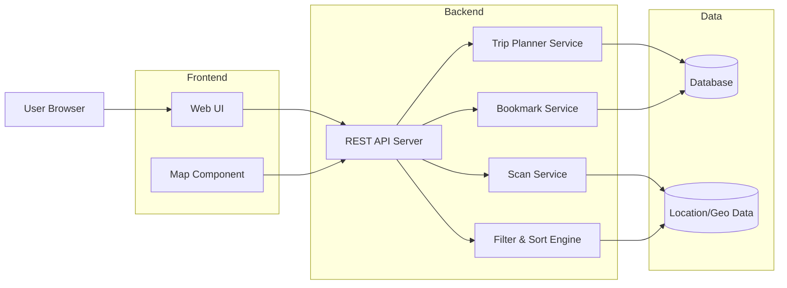
Use Case Diagram

Actors
 • User (ผู้ใช้งานทั่วไป)

Mermaid: Use Case Diagram 
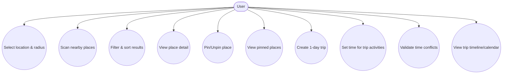

Other Designs (Optional but Recommended)

A) Sequence Diagram: Nearby Scan
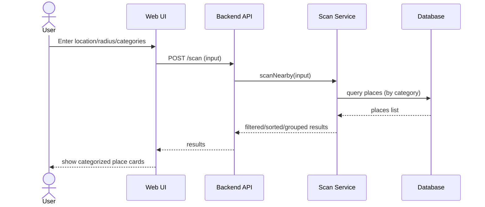
B) Sequence Diagram: Trip Validate (กันเวลาทับซ้อน)
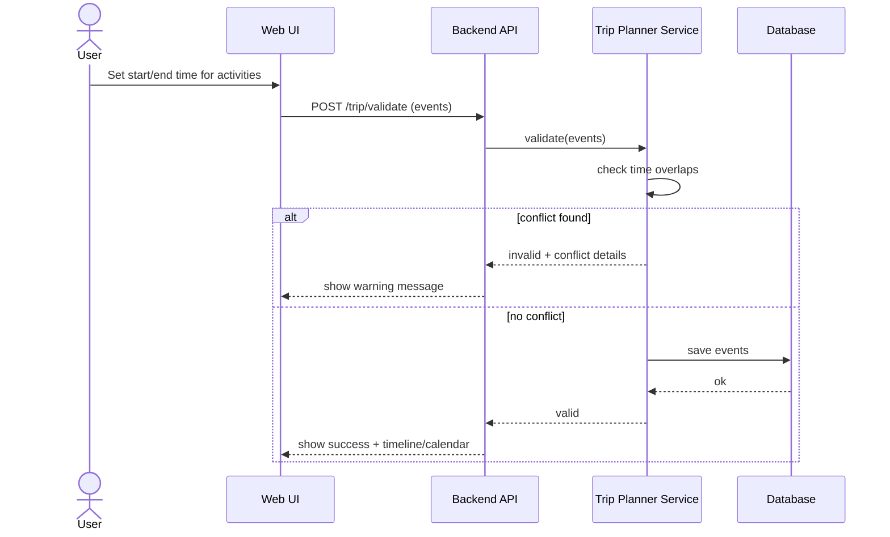

C) Activity Diagram: Trip Planner Flow
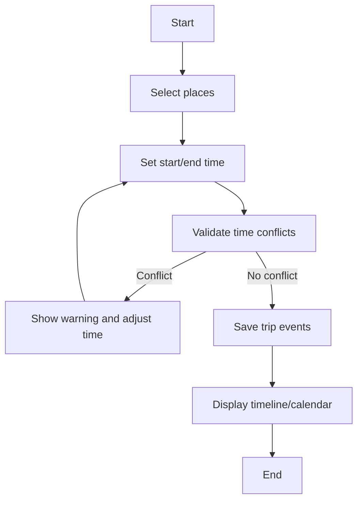
## 14) Website screenshot

### Page 1

### Page 2

### Page 3
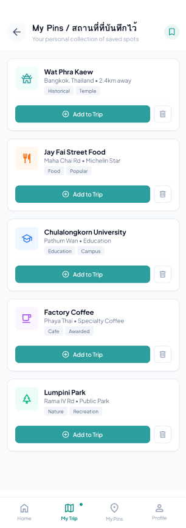

### Page 4
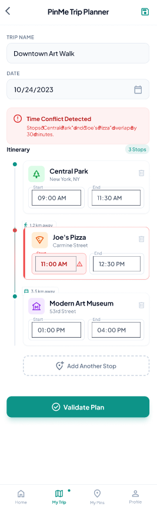

### Page 5

### page 6

### page 7

## System Workflow

### 1)Scan (การค้นหาสถานที่ใกล้เคียง)

#### ขั้นตอนที่ 1: ผู้ใช้กำหนดข้อมูล
ผู้ใช้กรอกข้อมูลดังต่อไปนี้:
- ตำแหน่งเริ่มต้น (Location)
- ระยะทางที่ต้องการค้นหา (เช่น 1, 3, 5 กิโลเมตร)
- หมวดหมู่ที่สนใจ (Hotel / Restaurant / Sport / Tourist)

#### ขั้นตอนที่ 2: ระบบประมวลผล
ระบบจะดำเนินการดังนี้:
- รับค่าพิกัด (Latitude, Longitude)
- คำนวณระยะทางระหว่างจุดตั้งต้นกับสถานที่ในฐานข้อมูล
- กรองเฉพาะสถานที่ที่อยู่ภายในรัศมีที่กำหนด
- แยกผลลัพธ์ตามหมวดหมู่
- เรียงลำดับตามระยะทาง (หากผู้ใช้เลือก)

#### ขั้นตอนที่ 3: แสดงผลลัพธ์
ระบบจะแสดง:
- รายชื่อสถานที่
- หมวดหมู่
- ระยะทางจากจุดตั้งต้น
- ปุ่ม View Detail และ Pin

---

### 2) Place Detail (ดูรายละเอียดสถานที่)

เมื่อผู้ใช้กดดูรายละเอียด:

ระบบจะ:
- ดึงข้อมูลสถานที่จากฐานข้อมูล
- แสดงชื่อ หมวดหมู่ ที่อยู่ และระยะทาง
- แสดงตำแหน่งบนแผนที่ (Map Preview)

ผู้ใช้สามารถ:
- ปักหมุด (Pin)
- เพิ่มสถานที่ลงในทริป

---

### 3) Pin / Bookmark (การปักหมุด)

เมื่อผู้ใช้กดปักหมุด:

- ระบบบันทึกข้อมูลลงในตาราง bookmarks
- ผู้ใช้สามารถดูรายการสถานที่ที่ปักหมุดไว้ในหน้า My Pins
- สามารถลบออกจากรายการ หรือเพิ่มเข้า Trip Planner

---

### 4) Mini Trip Planner (การสร้างทริป 1 วัน)

#### ขั้นตอนที่ 1: เลือกสถานที่
ผู้ใช้สามารถเลือกหลายสถานที่จาก:
- ผลการค้นหา
- รายการที่ปักหมุด

#### ขั้นตอนที่ 2: กำหนดเวลา
ผู้ใช้กำหนด:
- เวลาเริ่มต้น (Start Time)
- เวลาสิ้นสุด (End Time)

#### ขั้นตอนที่ 3: ระบบตรวจสอบความถูกต้อง
ระบบจะ:
- ตรวจสอบว่าช่วงเวลาของกิจกรรมทับซ้อนกันหรือไม่
- หากมีการทับซ้อน → แสดงข้อความแจ้งเตือน
- หากไม่มีการทับซ้อน → บันทึกข้อมูลลงฐานข้อมูล

#### ขั้นตอนที่ 4: แสดงผลแบบ Timeline
ระบบจะแสดง:
- ลำดับกิจกรรมเรียงตามเวลา
- รูปแบบปฏิทินหรือ Timeline รายวัน

---

## Core Processing Logic

### 1) Distance Calculation
ระบบใช้สูตรคำนวณระยะทางระหว่างพิกัด (เช่น Haversine Formula)  
เพื่อคัดกรองสถานที่ที่อยู่ภายในรัศมีที่กำหนด

---

### 2) Time Conflict Validation
ระบบจะ:
- ตรวจสอบกิจกรรมทั้งหมดภายในทริปเดียวกัน
- เปรียบเทียบช่วงเวลาเริ่มต้นและสิ้นสุด
- หากพบช่วงเวลาทับซ้อนกัน → แสดงข้อความ Error และไม่บันทึกข้อมูล

## Summary Retrospective Phase 2

[Retrospective Video Phase 2](https://youtu.be/1FdYNd2XVNs)

ใน Phase 2 ได้ออกแบบระบบ (Architecture, Use Case, Workflow) และพัฒนา Prototype ด้วย Figma และเว็บไซต์เบื้องต้น ทำให้เห็นภาพระบบชัดเจนมากขึ้นและลดความคลาดเคลื่อนจาก Phase 1

สิ่งที่ทำได้ดี: มี Prototype ช่วยให้เข้าใจตรงกันมากขึ้น และเริ่มแบ่งงานเป็นระบบ

ปัญหาที่พบ: ยังไม่คุ้นชินกับเครื่องมือบางอย่าง และมีความเข้าใจ flow บางส่วนไม่ตรงกัน

แนวทางปรับปรุง: เพิ่มการสื่อสารระหว่างทีม กำหนดมาตรฐานการทำงานให้ชัดเจน และปรับ Design ให้สอดคล้องกับ Implementation มากขึ้น

# Phase 3

## การทำงานของ Program
1. HTTP Methods ที่ใช้ (GET และ POST)

- GET Methods (การดึงข้อมูล):
	- Backend Serve Files: Server (server.js) ใช้รับ request แบบ GET สำหรับให้บริการ	ไฟล์ Static ของ Frontend ทั้งหมดแบบอัตโนมัติ (เช่น /, index.html, js/..., 	css/...)
	- External API Call: Backend ทำการสร้าง request แบบ GET เพื่อไปขอข้อมูลจาก 	SerpAPI (Google Maps Engine)
- POST Methods (การส่งข้อมูล):
	- มี 1 Method คือ /scan: เป็น Frontend API Endpoint ที่รับข้อมูลพิกัด 	(Latitude/Longitude), รัศมี (Radius) และ หมวดหมู่ (Category) จากผู้ใช้ (Frontend) 	เพื่อส่งให้ Backend ประมวลผลค้นหาสถานที่
2. การใช้ Template

- No Server-Side Templating: โปรเจคนี้ ไม่ได้ใช้ Template Engine บน Backend (เช่น EJS หรือ Pug)
- Client-Side Rendering (DOM Manipulation): ใช้ Client-Side Rendering สถาปัตยกรรมแบบ 	Single Page Application (SPA) โครงสร้างหลักอยู่ใน index.html และใช้ JavaScript 	(front_end/js/app.js) รูปแบบ **Template Literals (Backticks )** ในการสร้าง 	HTML Component แบบไดนามิก (เช่น การสร้างการ์ดผลลัพธ์result-card` แต่ละใบ และสร้าง	รายการ Trip Planner) ตามข้อมูล JSON ที่ได้รับกลับมาจาก Backend
3. การเรียก API (API Integration)
- Internal API: Frontend สื่อสารกับ Backend ผ่านการเรียก fetch แบบ POST ไปยัง Endpoint /scan
- External API (Third-party): Backend เมื่อได้รับข้อมูลจากผู้ใช้ จะทำการเรียก SerpAPI (Google Maps API) โดยส่ง Parameters ไปยัง https://serpapi.com/search.json แบบ GET Request เพื่อดึงข้อมูลสถานที่รอบตัว แล้วจึงนำ Response ที่เป็น JSON มากรอง (Filter) และเรียบเรียงใหม่ (Normalize) ก่อนส่งข้อมูลง่ายๆ กลับไปให้ Frontend

4. การคำนวณที่สำคัญ (Calculations)
- Haversine Formula (การคำนวณระยะทางบนพื้นผิวโลก):
	- เป็น Core Logic สำคัญที่สุดของแอป อยู่ในโหนด Backend (server.js และ 	models/Place.js)
	- เนื่องจาก API ภายนอกอาจคืนค่าสถานที่ที่ไกลเกินกำหนด โปรแกรมจึงนำพิกัดเส้นรุ้งเส้นแวงของจุด	ศูนย์กลาง (ผู้ใช้) และตำแหน่งสถานที่เป้าหมาย มาเข้าสูตร Haversine คำนวณออกมาเป็นระยะทาง	แบบ "กิโลเมตร" ที่แม่นยำ เพื่อใช้ในการกรอง (Filter) สถานที่ให้อยู่ใน "รัศมี (Radius)" ที่ผู้ใช้	กำหนด
- Time & Overlap Calculation (ระบบวางแผนทริป):
	- แปลง String รูปแบบเวลา HH:MM ให้เป็นหน่วย นาที (Minutes)
	- คำนวณระยะเวลา (Duration) และมี Algorithm ในการเช็คเวลาที่ทับซ้อนกัน (Overlap 	Detection) ของกิจกรรมที่ผู้ใช้พยามยามแอดเข้าใน Timeline ของวัน

5. Graph หรือ การแสดงผลเชิงภาพ (Visualizations)
- ไม่มีกราฟแบบดั้งเดิม (เช่น กราฟแท่ง กราฟเส้น)
- ใช้ Interactive Map (แผนที่แบบตอบโต้ได้) ดึงจาก Leaflet.js และ OpenStreetMap (OSM) แทน Graph หลัก
- มีการนำข้อมูลที่ได้มาพล็อต (Plot) ลงบนแกน X/Y ของพิกัดแผนที่:
	- วาดรัศมีวงกลม (Radius Circle) ปรับขนาดตามกิโลเมตร
	- พล็อตหมุด (Place Markers) สีและไอคอนแยกตามหมวดหมู่
	- พล็อตหมุดตำแหน่งผู้ใช้ปัจจุบันแบบมี Animation (Pulsing Marker)

## Test Case
### ตาราง Unit Test Cases

ตารางด้านบนแสดงกรณีทดสอบ (Test Cases) จำนวน 10 กรณี ที่กลุ่มของเราได้ออกแบบมาเพื่อตรวจสอบความถูกต้องของ Data Structure และ Business Logic หลักในโฟลเดอร์ model โดยแบ่งกลุ่มการทดสอบตาม Class ได้ดังนี้:

1.Place Model : เน้นทดสอบการจัดการข้อมูลสถานที่ โดยตรวจสอบว่าระบบสามารถคัดกรองพิกัด (Latitude/Longitude) ที่เป็นไปได้จริงเท่านั้น และสามารถแปลงหมวดหมู่สถานที่ (Category) จาก API ให้อยู่ในรูปแบบมาตรฐานของระบบได้ (เช่น แปลงตัวพิมพ์ใหญ่-เล็ก หรือดักจับหมวดหมู่ที่ไม่รู้จัก)

2.SearchQuery Model : ตรวจสอบความถูกต้องของพารามิเตอร์ก่อนส่งไปค้นหากับ API ภายนอก โดยระบบต้องสามารถดักจับ (Validate) กรณีที่ผู้ใช้ไม่ได้ระบุพิกัด หรือระบุพิกัดผิดรูปแบบ เพื่อป้องกันไม่ให้เกิด Error ในฝั่ง Backend

3.TripPlanner Model : เป็นหัวใจสำคัญของฟีเจอร์จัดทริป จึงเน้นทดสอบลอจิกการคำนวณเวลา โดยทดสอบทั้งการแปลง String เป็นนาที, การแปลงนาทีกลับเป็นรูปแบบเวลา (HH:MM) และการหาระยะเวลาระหว่างช่วงเวลา รวมถึงมีการทดสอบกรณีขอบ (Edge Cases) เช่น การกรอกเวลาที่เกิน 24 ชั่วโมง ซึ่งระบบต้องคืนค่าเป็น NaN ได้อย่างถูกต้อง

การทดสอบทั้ง 10 กรณีนี้ ครอบคลุมทั้งกรณีที่ข้อมูลถูกต้อง (Happy Path) และกรณีที่ข้อมูลผิดปกติ (Error Handling) เพื่อให้มั่นใจว่ารากฐานข้อมูลของระบบมีความเสถียรและพร้อมนำไปใช้งานต่อในส่วนอื่นๆ

## ตัวอย่าง Test Case Code

### ตัวอย่างที่ 1: การทดสอบ Haversine Formula (จากไฟล์ Place.test.js)
ใช้ทดสอบว่าระบบสามารถคำนวณระยะทางจาก Latitude/Longitude 2 จุดบนโลกได้แม่นยำหรือไม่

### ตัวอย่างที่ 2: การทดสอบเพิ่มกิจกรรมและเช็คเวลาทับซ้อน (จากไฟล์ TripPlanner.test.js)
ใช้ทดสอบว่าคลาสผู้เชี่ยวชาญการจัดทริป สามารถตรวจจับว่าคุณไม่สามารถเพิ่มกิจกรรมที่เวลาทับซ้อนกับกิจกรรมอื่นที่มีอยู่แล้วได้

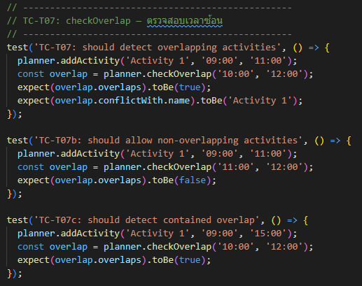

### ตัวอย่างที่ 3: การทดสอบ Validation (จากไฟล์ SearchQuery.test.js)
ใช้ทดสอบว่าผู้ใช้อาจเผลอป้อน Latitude หรือ Longitude ผิดพลาด ระบบต้องจับผิดได้

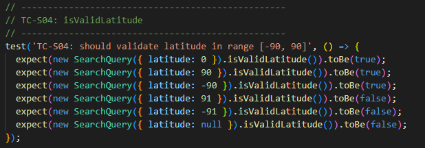

## สิ่งที่ยังไม่เสร็จสมบูรณ์ (bugs and limitations)

1. ข้อจำกัดในการรองรับเที่ยวข้ามคืน (Cross-midnight Trip Bug)
รายละเอียด: ระบบ Trip Planner ปัจจุบันมีเงื่อนไข Validation ว่า EndTime ต้องมากกว่า StartTime เสมอ `if (start >= end)` ทำให้ผู้ใช้ไม่สามารถเพิ่มกิจกรรมที่ลากยาวผ่านช่วงเที่ยงคืนได้ (เช่น เริ่ม 23:00 น. สิ้นสุด 02:00 น. ของอีกวัน) 
ผลกระทบ: ระบบจะมองว่าเป็น Error "เวลาสิ้นสุดต้องมากกว่าเวลาเริ่ม"

2. ข้อมูลทริปสูญหายเมื่อรีเฟรชหน้าเว็บ (No Data Persistence)
รายละเอียด: สถานะการปักหมุด (Pinned places) และรายการกิจกรรมวางแผนทริป (Trip Planner) ปัจจุบันถูกจัดเก็บอยู่ในหน่วยความจำชั่วคราว (In-memory Array) ของ JavaScript 
ผลกระทบ: หากผู้ใช้กดรีเฟรชหน้าเว็บ (F5) หรือปิดเบราว์เซอร์ ข้อมูลแผนการเดินทางทั้งหมดจะสูญหายเนื่องจากยังไม่ได้เชื่อมต่อกับ Database หรือ LocalStorage

3. ขาดระบบแบ่งหน้าผลลัพธ์ (Missing Pagination)
รายละเอียด:API ค้นหาสถานที่ (SerpAPI) อาจมีการจำกัดการคืนค่าผลลัพธ์ต่อ 1 Request (เช่น คืนค่ามาแค่ 20 สถานที่แรก) 
ผลกระทบ: ปัจจุบันหน้า UI ยังไม่รองรับระบบ "โหลดเพิ่มเติม (Load More)" หรือ Pagination ทำให้ผู้ใช้ไม่สามารถดูสถานที่ทั้งหมดในหมวดหมู่นั้นๆ ได้หากมีจำนวนมาก

4. ความราบรื่นในการขอสิทธิ์ GPS (Geolocation Edge Case)
รายละเอียด: หากผู้ใช้ปฎิเสธการให้สิทธิ์เข้าถึงตำแหน่ง (Location Permission) ในครั้งแรก ระบบจะแสดง Error อย่างถูกต้อง 
ผลกระทบ: หากผู้ใช้ไปเปลี่ยนการตั้งค่าอนุญาตในภายหลัง ผู้ใช้จำเป็นต้องรีเฟรชหน้าเว็บใหม่ทั้งหมด (Hard Refresh) เพื่อให้ระบบตรวจจับสิทธิ์ใหม่ เนื่องจากยังไม่มีปุ่ม "ลองเชื่อมต่อ GPS อีกครั้ง (Retry GPS)"

5. การจัดการข้อผิดพลาดจาก External API (Third-party API Error Handling)
รายละเอียด: หาก Quota ของ SerpAPI หมด หรือรหัส API Key มีปัญหา ระบบ Backend จะไม่สามารถดึงข้อมูลได้ 
ผลกระทบ: แม้จะมีการทำ Try-Catch ไว้ แต่ Error Message ที่ส่งไปให้ Frontend อาจจะยังเป็น Error ทั่วไป (เช่น "เกิดข้อผิดพลาดในการเชื่อมต่อ") แทนที่จะระบุชัดเจนว่า "ระบบ API ภายนอกขัดข้อง"

## Website Screenshot
